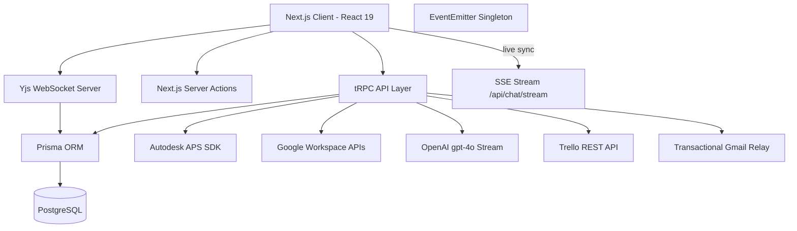

# Architecture - LECG Dashboard

> Auto-generated by Antigravity on 2026-04-15 (Master Deep Phase)

## Overview

The LECG Dashboard is a high-fidelity BIM management and synchronization platform built on **Next.js 15 (App Router)** and **tRPC**. It provides a unified portal for tracking parametric families, managing clash detection workflows, and evaluating Revit exam results.

## Service Integration Topology

The application orchestrates 8+ external production services, utilizing custom workarounds to maximize performance and bypass API constraints.

### 1. High-Privilege Service Perimeter (Google)

The system uses a **Google Service Account** (`GOOGLE_SERVICE_ACCOUNT_KEY`) as its primary background identity for Sheets, Drive, and Forms.

- **Dynamic Decryption**: The `resolveServiceAccountCredentials` logic handles keys in three formats: Plain JSON string, Base64-encoded JSON, or a File path to a `.json` key.
- **Hybrid API Workaround (Forms)**: To bypass service-account creation quotas, the system uses the **Drive API** to initialize a form file in a specific folder (`GOOGLE_DRIVE_FOLDER_ID`) before using the **Forms API** (`batchUpdate`) to inject questions and internal metadata.

### 2. BIM AI Streaming Pipeline (OpenAI)

The `generateFamilyDescription` logic leverages `gpt-4o` to generate technical documentation on-the-fly.

- **Changelog Delta Analysis**: The prompt summarizes the `FamilyChangelog` history (v1, v2, etc.) to inform the AI of the family's development trajectory.
- **Streaming Response**: Uses a `ReadableStream` to pipe OpenAI tokens directly to the client, providing a responsive experience for technical writing.

### 3. Trello Synchronization Architecture

The platform maintains a bidirectional sync with Trello to manage external task boards.

- **N+1 Optimization**: Uses the `getMemberCardsWithChecklists` pattern to retrieve all member cards and their embedded checklists in a **single Trello API call**.
- **Workarounds**: Implements a `moveCheckItem` workaround (Post-Delete-Post) since the Trello API does not natively support moving items between checklists.

### 4. Autodesk APS Derivative Pipeline

Used for web-based Revit family visualization.

- **Lifecycle**: `Local Buffer → OSS Bucket (Internal Token) → startJob (SVF2) → Manifest Polling`.
- **URN Generation**: Object IDs are base64url-encoded and sanitized to produce the derivative URN required by the APS Viewer.

### 5. Transactional Email Relay (Gmail OAuth)

Unlike standard SMTP relays, the system uses a **Gmail OAuth** provider for critical onboarding (`ApprovedEmail`) and password resets.

- **Identity Persistence**: Relies on a shared `GMAIL_USER` and a persistent `refreshToken` to maintain the delivery pipeline without requiring user-level credential management.

## Real-time & Synchronization

### Event-Driven Invalidation

- **SSE Stream**: A pull-based `EventSource` on the client mocks "Push" by polling Google Chat APIs at **5s intervals**.
- **UI Refresh**: Client-side triggers `trpc.useUtils().invalidate()` upon receiving signals from the live stream.

### CRDT Persistence

- **Binary Sync**: Wiki content is held in `Bytea` (PostgreSQL) and hydrated as a `Y.Doc` binary state to support sub-millisecond real-time collaboration.

## Deployment Profile

- **Infrastructure**: Hosted on **Railway** via the **Nixpacks** builder.
- **Runtime Constraint**: Standardized on **Node.js 20**.
- **Networking**: Configured with `X-Accel-Buffering: no` to support persistent SSE connections.
