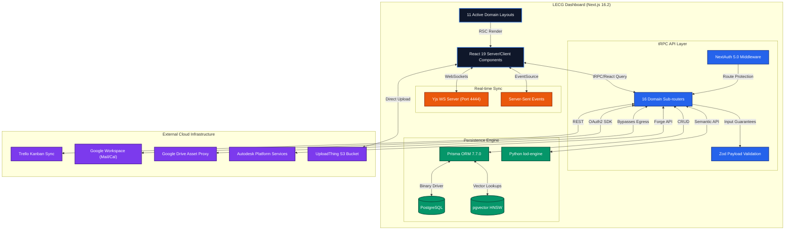
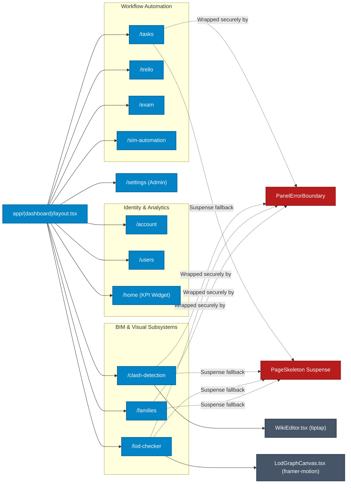
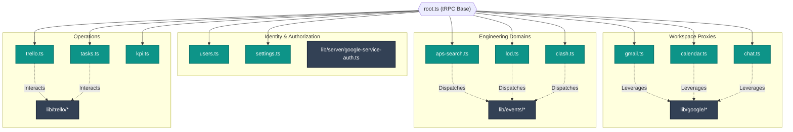
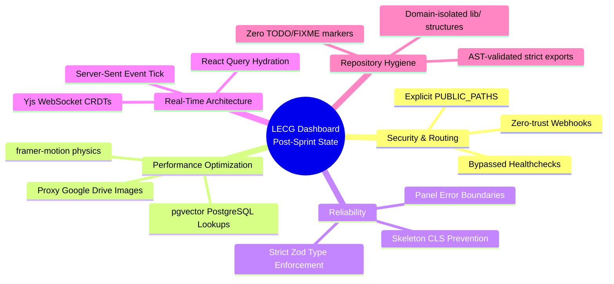

# Architecture - LECG Dashboard

> Auto-generated entirely as Mermaid representations on 2026-04-17

## 1. Global Topology & Integrations

## 2. Frontend Routing Topology

## 3. Backend & Utility Domain Map

## 4. Structural Paradigms & Conventions

