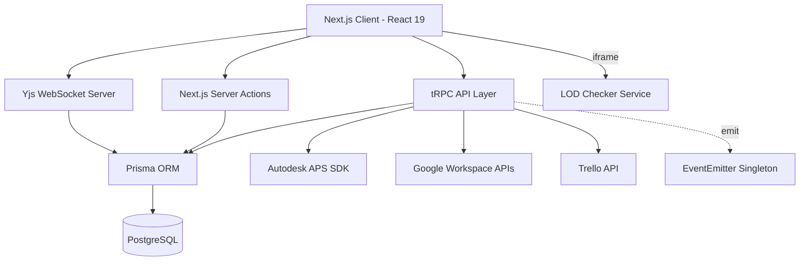

# Architecture - LECG Dashboard

> Auto-generated by Antigravity on 2026-04-15 (Master Phase)

## Overview

The LECG Dashboard is a comprehensive BIM management and synchronization platform. It serves as a central hub for tracking parametric families, managing clash detection workflows, automating SIM tasks, and conducting Revit competency exams.

The system is built on **Next.js 15 (App Router)** and utilizes a **tRPC** API layer for type-safe communication between the frontend and the PostgreSQL database.

## Core Components

### 1. Frontend (`app/`, `components/`)

- **App Router**: Managed navigation and layout state.
- **Shared UI**: Built with **Tailwind CSS 4**, **Radix UI**, and **Shadcn**.
- **Real-time Collaboration**: **Tiptap** editors synced via **Yjs** for Wiki modules.
- **UX Flow**: `NavigationProvider` intercepts all link clicks to provide an instant, blurred loading overlay, mask Next.js navigation latency.

### 2. API Layer (`server/routers/`)

- **Root Router**: Entry point in `server/routers/root.ts`.
- **Feature Routers**: Modular routers for `families`, `clash`, `sim`, `tasks`, `users`, `trello`, `calendar`, `chat`, etc.
- **KPI Engine**: The `kpiRouter` aggregates data from all modules (Families, Clash, Exams) to calculate derived metrics like **Capacity** and **Velocity**.

### 3. Service Integrations (`lib/`)

- **APS Service**: Handles Autodesk authentication, model derivatives, and OSS storage.
- **Google Service**: Comprehensive suite for Calendar, Chat (notifications), Directory (user management), and Drive.
- **Trello Service**: Syncs tasks and events with Trello boards.
- **AI Service**: Integration with OpenAI for automated insights.

### 4. Data Layer (`prisma/`)

- **Schema**: Relational model defined in `prisma/schema.prisma`.
- **Migration Management**: Managed via Prisma Migrate.
- **Yjs Persistence**: Binary Yjs state stored in PostgreSQL for wiki hydration.

## Operational Philosophy

### Context-Singleton Pattern

The system implements a specialized `createTRPCContext` in `server/trpc.ts`. For every request, the context:

- Ensures a valid **Session** is present.
- Fetches/Initializes a **Project Singleton**. If no project exists in the database, the system automatically creates a "Default Project" and caches its ID for the process lifetime. This pattern allows the system to remain multi-project capable while currently operating as a high-fidelity singleton dashboard.

### Tiered Procedure Protection

Access to API procedures is strictly enforced via three primary tRPC middleware layers:

- **`protectedProcedure`**: Requires a valid user session.
- **`editorProcedure`**: Requires either an `EDITOR` or `ADMIN` role.
- **`adminProcedure`**: Exclusive to users with the `ADMIN` role.

The `middleware.ts` layer provides an additional perimeter check on the edge, decoding the JWT to prevent unauthorized module-level initial navigation.

## Advanced Data Patterns

### Event-Driven Signaling

The `lib/user-events.ts` singleton provides an internal `EventEmitter` for reactive cross-service signaling.

- **Usage**: When a user's role or module access is updated, or when an account is linked, the system emits events that other internal services (e.g., logging or notification dispatchers) can subscribe to without tight coupling.

### Single-Flight Caching

The `Google Directory` service (`lib/google-directory.ts`) implements a sophisticated caching strategy to stabilize the platform's relationship with external APIs.

- **Single-Flight**: Prevents redundant, concurrent API calls for the same data (e.g., fetching the organization directory) by deduplicating in-flight promises.
- **Multi-Layer Cache**: Combines short-term memory caches for frequent lookups (5m TTL) with persistent session-linked tokens.

### Real-time Collaboration (Yjs)

The wiki modules utilize a standalone WebSocket server (`scripts/yjs-server.cjs`) to facilitate real-time editing.

- **Binary Sync**: All edits are handled via CRDT binary updates, ensuring conflict-free merging.
- **Direct Persistence**: The Yjs server bypasses the main Next.js API, using its own Prisma instance to perform debounced saves (3-second delay) of the `yjsState` bytes directly into the `ClashWiki` or `SimWiki` models.

### Ecosystem & LOD Checker

The platform acts as an aggregator for specialized BIM tools. The **LOD Checker** is a separate Flask/Vite application that is seamlessly hosted within the Dashboard via an iframe portal.

- **Service Sync**: The dashboard's orchestrator starts the LOD Checker on port 5173.
- **Connectivity Detection**: The dashboard HUD monitors the LOD service health and provides direct fallback links if the internal frame fails to synchronize.

## Data Flow

1. **Request**: User interacts with a component (e.g., editing a Wiki section).
2. **Sync**: Edits are broadcast via the Yjs WebSocket server to other peers and queued for DB persistence.
3. **API Call**: Global metadata changes trigger tRPC mutations.
4. **Business Logic**: The router procedure validates input (Zod) and calls appropriate lib services.
5. **Persistence**: Prisma updates the main database.
6. **Response**: UI updates via optimistic cycles or React Query invalidation.

## Technical Debt

### Identified Areas for Improvement

- **Module Redundancy**: `SimWiki` and `SimTask` are currently clones of `ClashWiki` and `ClashTask`. Consider abstracting into a generic `WikiModule` / `TaskModule` pattern.
- **Error Handling**: Many `lib/` calls have inconsistent try/catch patterns. A central error handling middleware for tRPC is recommended.
- **Status labels**: The term `TODO` is used both as a status string and a developer comment, leading to ambiguity in global searches.
- **Caching Consolidation**: While individual services (Directory, KPI) have custom caching, a centralized Redis or similar persistent cache would further reduce external API latency.

## Conventions

- **Naming**: PascalCase for components, camelCase for variables/functions, kebab-case for CSS classes.
- **Structure**: Features grouped in `app/` (dashboard routes) and shared logic in `lib/`.
- **Auth**: Managed via **NextAuth v5 beta**, using Prisma adapter.
