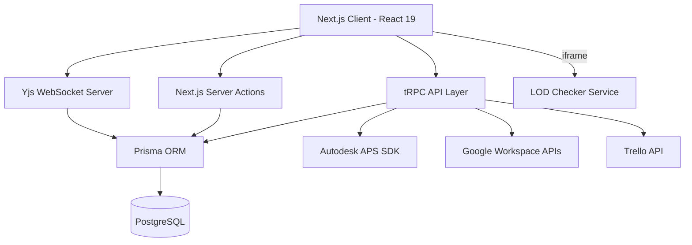

# Architecture - LECG Dashboard

> Auto-generated by Antigravity on 2026-04-15 (Super Phase)

## Overview

The LECG Dashboard is a comprehensive BIM management and synchronization platform. It serves as a central hub for tracking parametric families, managing clash detection workflows, automating SIM tasks, and conducting Revit competency exams.

The system is built on **Next.js 15 (App Router)** and utilizes a **tRPC** API layer for type-safe communication between the frontend and the PostgreSQL database.

## Core Components

### 1. Frontend (`app/`, `components/`)

- **App Router**: Managed navigation and layout state.
- **Shared UI**: Built with **Tailwind CSS 4**, **Radix UI**, and **Shadcn**.
- **Real-time Collaboration**: **Tiptap** editors synced via **Yjs** for Wiki modules.

### 2. API Layer (`server/routers/`)

- **Root Router**: Entry point in `server/routers/root.ts`.
- **Feature Routers**: Modular routers for `families`, `clash`, `sim`, `tasks`, `users`, `trello`, `calendar`, `chat`, etc.
- **Type Safety**: End-to-end Zod validation for all procedures.

### 3. Service Integrations (`lib/`)

- **APS Service**: Handles Autodesk authentication, model derivatives, and OSS storage.
- **Google Service**: Comprehensive suite for Calendar, Chat (notifications), Directory (user management), and Drive.
- **Trello Service**: Syncs tasks and events with Trello boards.
- **AI Service**: Integration with OpenAI for automated insights.

### 4. Data Layer (`prisma/`)

- **Schema**: Relational model defined in `prisma/schema.prisma`.
- **Migration Management**: Managed via Prisma Migrate.
- **Yjs Persistence**: Binary Yjs state stored in PostgreSQL for wiki hydration.

## Security & Middleware Deep-Dive

The application implements a robust security perimeter through a multi-layered middleware and authentication strategy.

### origin Rewriting & Tunneling

The `middleware.ts` includes a specialized `rewriteAuthRedirectLocation` function. This logic detects if the request origin is a local or private hostname (e.g., `localhost`, `10.x.x.x`) and ensures that OAuth redirection values remain consistent with the current connection. This is critical for supporting Ngrok tunnels and internal LAN access without breaking session integrity.

### Module-Level Access Control

Access to features like `/families`, `/clash-detection`, and `/lod-checker` is restricted via the `MODULE_ROUTES` mapping in the middleware.

- **JWT Claims**: The system decodes the `authjs.session-token` on the edge to check for `moduleAccess` and `role` claims.
- **Admin Override**: Users with the `ADMIN` role bypass all module-level checks.

## Auth Architecture

- **NextAuth v5**: Utilizes the latest beta for edge-compatible session management.
- **Email Normalization**: The `signIn` callback in `server/auth.ts` implements "Admin Aliases," mapping multiple identities (e.g., secondary admin emails) to a single primary admin ID.
- **Real-time Enrichment**: The session and JWT callbacks perform live database lookups to ensure roles, permissions, and available OAuth providers are always up-to-date without requiring a logout/login cycle.

## Real-time Collaboration (Yjs)

The wiki modules utilize a standalone WebSocket server (`scripts/yjs-server.cjs`) to facilitate real-time editing.

- **Binary Sync**: All edits are handled via CRDT binary updates, ensuring conflict-free merging.
- **Direct Persistence**: The Yjs server bypasses the main Next.js API, using its own Prisma instance to perform debounced saves (3-second delay) of the `yjsState` bytes directly into the `ClashWiki` or `SimWiki` models.

## Ecosystem & LOD Checker

The platform acts as an aggregator for specialized BIM tools. The **LOD Checker** is a separate Flask/Vite application that is seamlessly hosted within the Dashboard via an iframe portal.

- **Service Sync**: The dashboard's orchestrator starts the LOD Checker on port 5173.
- **Connectivity Detection**: The dashboard HUD monitors the LOD service health and provides direct fallback links if the internal frame fails to synchronize.

## Data Flow

1. **Request**: User interacts with a component (e.g., editing a Wiki section).
2. **Sync**: Edits are broadcast via the Yjs WebSocket server to other peers and queued for DB persistence.
3. **API Call**: Global metadata changes trigger tRPC mutations.
4. **Business Logic**: The router procedure validates input (Zod) and calls appropriate lib services.
5. **Persistence**: Prisma updates the main database.
6. **Response**: UI updates via optimistic cycles or React Query invalidation.

## Technical Debt

### Identified Areas for Improvement

- **Module Redundancy**: `SimWiki` and `SimTask` are currently clones of `ClashWiki` and `ClashTask`. Consider abstracting into a generic `WikiModule` / `TaskModule` pattern.
- **Error Handling**: Many `lib/` calls have inconsistent try/catch patterns. A central error handling middleware for tRPC is recommended.
- **Status labels**: The term `TODO` is used both as a status string and a developer comment, leading to ambiguity in global searches.
- **Caching**: Heavy reliance on React Query; server-side caching (e.g., Redis) for Google Directory lookups could improve latency.

## Conventions

- **Naming**: PascalCase for components, camelCase for variables/functions, kebab-case for CSS classes.
- **Structure**: Features grouped in `app/` (dashboard routes) and shared logic in `lib/`.
- **Auth**: Managed via **NextAuth v5 beta**, using Prisma adapter.
