# Architecture

> Auto-generated by /map on 2026-04-22

## Overview

LECG Dashboard is a high-performance, BIM-integrated management platform for AEC (Architecture, Engineering, Construction) projects. It provides specialized modules for Parametric Families, Clash Detection, and Sim Automation, with deep integrations into Autodesk APS and Google Workspace.

```mermaid
graph TD
    User((User))
    Web[Next.js App Router]
    TRPC[tRPC API Layer]
    Hocus[Hocuspocus Yjs Server]
    DB[(PostgreSQL - Supabase)]
    Redis[(Redis - Upstash)]
    APS[Autodesk APS]
    Google[Google Workspace API]
    UT[UploadThing]
    AI[OpenAI GPT-4o]

    User <--> Web
    Web <--> TRPC
    Web <--> Hocus
    TRPC <--> DB
    TRPC <--> Google
    TRPC <--> APS
    TRPC <--> UT
    TRPC <--> AI
    Hocus <--> DB
    Web <--> Redis
```

## Components

### 1. Web Frontend (Next.js)
- **Purpose:** Primary user interface and server-side rendering.
- **Location:** `app/`, `components/`
- **Dependencies:** React 19, TailwindCSS, Framer Motion, Tiptap.

### 2. tRPC API Layer
- **Purpose:** Typesafe API boundary between client and server.
- **Location:** `server/routers/`
- **Dependencies:** Prisma, zod.

### 3. Collaboration Engine (Hocuspocus)
- **Purpose:** Real-time multi-user editing for Wiki and Canvas.
- **Location:** `scripts/yjs-server.mjs`, `components/clash/wiki-editor/`
- **Dependencies:** Yjs, Hocuspocus, y-websocket.

### 4. LOD Checker Engine
- **Purpose:** Python-based image processing and graph preparation for BIM LOD validation.
- **Location:** `services/lod-engine/`
- **Dependencies:** Python, Flask, PyTorch (SigLIP).

## Data Flow

1. **Authentication**: Handled via `next-auth` (v5) using Google OAuth and local credentials.
2. **Wiki Collaboration**: Client connects to Hocuspocus server via WebSocket → Server authenticates via JWT → Server fetches/stores state in PostgreSQL using Prisma.
3. **BIM Integration**: Autodesk APS URNs are stored in PostgreSQL → Frontend uses APS Viewer component to render models → Backend uses APS SDK for data extraction.

## Integration Points

| Service | Type | Purpose |
|---------|------|---------|
| Supabase | Database | Primary relational storage (PostgreSQL). |
| Autodesk APS | API/SDK | BIM model rendering and metadata. |
| Google Cloud | API | Sheets sync, Drive storage, and Gmail. |
| UploadThing | SaaS | Secure file uploads for avatars and media. |
| OpenAI | API | AI-powered search and content generation. |
| Upstash | Redis | Rate limiting and real-time pulse monitoring. |

## Technical Debt

- [x] **Supabase RLS**: Hardened security by enabling RLS on all tables (2026-04-22).
- [x] **Yjs Server Migration**: Successfully migrated to Hocuspocus v3 with robust DB persistence.
- [ ] **Typecheck Sweep**: Remaining type errors in `LodGraphCanvas` and older components.
- [ ] **Logging**: Centralize remaining raw `console.log` calls in `WikiEditor.tsx`.
- [ ] **Prisma Migration**: Fully transition all raw SQL queries in older services to Prisma.
