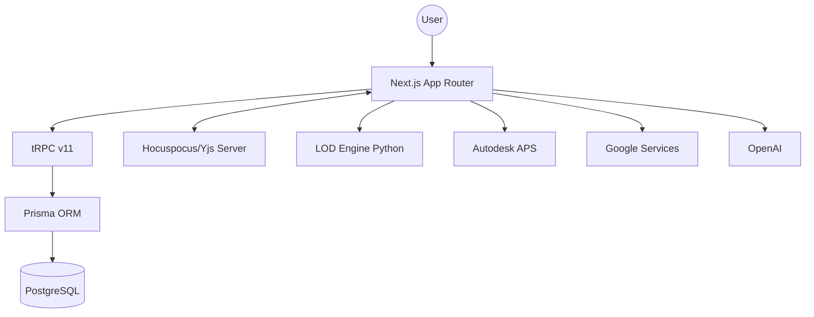

# Architecture

> Auto-generated by /map on 2026-04-28

## Overview

LECG Dashboard is a multi-module enterprise platform for AEC (Architecture, Engineering, and Construction) management. It integrates project tracking, BIM (Building Information Modeling) data, and collaborative tools into a unified Next.js interface.

## Components

### 1. Dashboard UI (app/)
- **Purpose:** Primary user interface built with Next.js App Router.
- **Location:** `app/`
- **Key Routes:**
    - `(dashboard)/home`: Executive overview and KPI charts.
    - `(dashboard)/clash-detection`: Collaborative wiki and clash management.
    - `(dashboard)/families`: Component/Family library with Kanban tracking.
    - `(dashboard)/lod-checker`: BIM Level of Development validation.
    - `(auth)`: Login, Register, and Account Setup.

### 2. tRPC API (lib/trpc)
- **Purpose:** Type-safe API communication between frontend and backend.
- **Location:** `lib/trpc/`
- **Logic:** Handlers for database operations, integration orchestration, and business rules.

### 3. Collaboration Layer (Hocuspocus)
- **Purpose:** Real-time multi-user editing for Wikis and Documents.
- **Location:** `scripts/yjs-server.mjs`
- **Logic:** Uses Yjs and Hocuspocus to synchronize Tiptap editor states.

### 4. LOD Engine (services/lod-engine)
- **Purpose:** Specialized backend for image processing and BIM model validation.
- **Location:** `services/lod-engine/`
- **Stack:** Python, Flask (server.py), and custom image pipeline.

## Data Flow

1. **User Interaction**: User interacts with a React component (e.g., updating a Family status).
2. **API Call**: Component triggers a tRPC mutation.
3. **Business Logic**: tRPC handler validates input and updates the database via Prisma.
4. **Persistence**: Changes are saved to PostgreSQL.
5. **Real-time Sync**: For collaborative areas (Wikis), changes are broadcast via Yjs/Hocuspocus to other connected users.

## Integration Points

| Service | Type | Purpose |
|---------|------|---------|
| Autodesk APS | SDK/API | AEC Model viewing, metadata extraction, and derivative processing. |
| Google Drive/Gmail | OAuth/API | File storage integration and automated email workflows. |
| OpenAI | API | AI-powered descriptions and content generation. |
| Uploadthing | API | Managed file uploads for assets and documents. |
| Upstash | Redis | Rate limiting and caching. |

## Technical Debt

- [ ] **TODO markers in Families**: `FamilyCard.tsx` and `KanbanBoard.tsx` have hardcoded status logic.
- [ ] **Python/JS Split**: Coordination between Node.js and LOD Engine (Python) requires manual stack management (`run_dev_stack.py`).
- [ ] **Prisma/Hocuspocus Integration**: Synchronization between collaborative state and permanent DB needs hardening.

## Conventions

- **Naming**: PascalCase for components, camelCase for variables/functions.
- **Structure**: Feature-based directory structure under `components/`.
- **Testing**: Playwright for E2E testing (indicated by `.playwright-mcp`).
