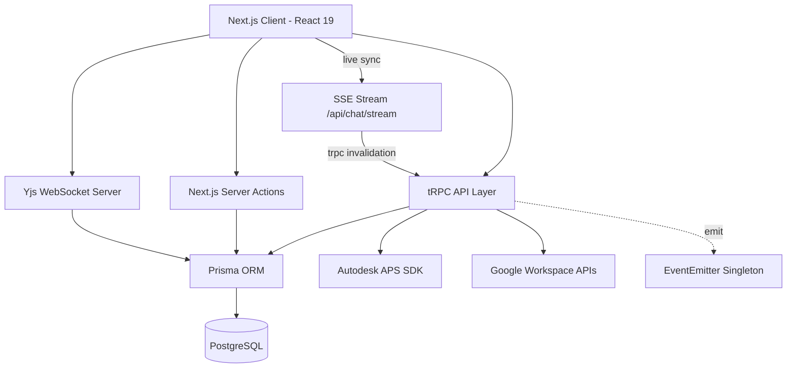

# Architecture - LECG Dashboard

> Auto-generated by Antigravity on 2026-04-15 (Super Deep Phase)

## Overview

The LECG Dashboard is a high-fidelity BIM management and synchronization platform built on **Next.js 15 (App Router)** and **tRPC**. It provides a unified portal for tracking parametric families, managing clash detection workflows, and evaluating Revit exam results.

## Technical Core: Concurrency & Caching

The application implements a sophisticated **Single-Flight** concurrency pattern to maintain platform stability under heavy load, especially during high-frequency API polling.

### Single-Flight Promise Deduplication

In the `Google Directory` and `Google Chat` services, concurrent requests for the same data (e.g., fetching a user profile or organization directory) are deduplicated using a `Map<string, Promise<T>>` in-flight registry.

- **Workflow**: If a request is already "in-flight," secondary callers receive the SAME promise instead of initiating a new network request.
- **Cleanup**: Promises are removed from the map in a `finally` block, ensuring subsequent calls can trigger a fresh fetch if the cache has expired.

### Multi-Layer Caching Strategy

- **L1 (In-Memory)**: Global `Map` objects with individual TTLs (e.g., 5m for Directory, 30s for Chat Spaces).
- **L2 (Proactive Hydration)**: The `listOrgDirectoryPeople` call proactively populates a `globalPersonCache` for all discovered users, reducing latency for subsequent individual profile lookups.
- **L3 (Auth Session)**: Extended session objects store `moduleAccess` and `role` claims to minimize DB hits during procedure validation.

## Real-time Architecture: Server-Sent Events (SSE)

The Dashboard implements a custom SSE stream (`/api/chat/stream`) to mock "Push" notifications from the Google Chat API without requiring expensive Webhooks.

### Streaming Lifecycle

- **Heartbeating**: Continuous `: keep-alive` comments sent every **20 seconds** to prevent proxy/browser timeout.
- **Polling Interval**: High-frequency **5-second** poll cycles for the most recent 10 spaces.
- **Sequential Batching**: Polls are batched (size: 3) and executed sequentially to avoid burst quota hits on the Google API.
- **Retry Logic**: Client-side `EventSource` is configured with `retry: 5000` for deterministic reconnection.

### Client-Side Invalidation Graph

The `useChatPulse` hook manages the live stream on the client. When a `new_message` event is received:

1.  **Deduplication**: Message IDs are held in a 50-item `Set` to handle potential burst delivery.
2.  **Proactive Invalidation**: The hook calls `trpc.useUtils().invalidate()` for both **Spaces** and **Messages** lists, ensuring the UI stays fresh without a full page reload.

## Intelligence: Metadata Extraction Heuristics

The system utilizes fuzzy matching heuristics to extract un-mapped metadata (e.g., Cost Centers) from unformatted Google Workspace profile fields (userDefined/clientData).

- **Fuzzy Keys**: Scans for terms like `centro de costos`, `presupuesto`, and `cost centre`.
- **Primary Preference**: Always favors values marked as `primary` in the Google People API response before falling back to index 0.

## Auth & Session Envelope Schema

The `Session` and `JWT` objects are extended via module augmentation in `types/next-auth.d.ts`:

| Property | Type | Description |
|----------|------|-------------|
| **`id`** | `string` | Unique internal CUID |
| **`role`** | `string` | Global permission claim (`ADMIN`, `EDITOR`, `VIEWER`) |
| **`providers`** | `string[]` | List of linked identity providers |
| **`hasCredentials`** | `boolean` | Whether the user has a local password |
| **`moduleAccess`** | `string[]` | List of BIM modules the user is allowed to access |

## Architecture Guidelines

- **Zero-Transform Streaming**: SSE headers include `no-transform` and `no-cache` to ensure data moves through proxies (like Ngrok or Cloudflare) without buffering.
- **Tiered Protection**: Procedure isolation (`protected` | `editor` | `admin`) is the primary internal perimeter.
- **Event-Driven Signaling**: `EventEmitter` is reserved for process-internal signaling between tRPC handlers and background tasks.
