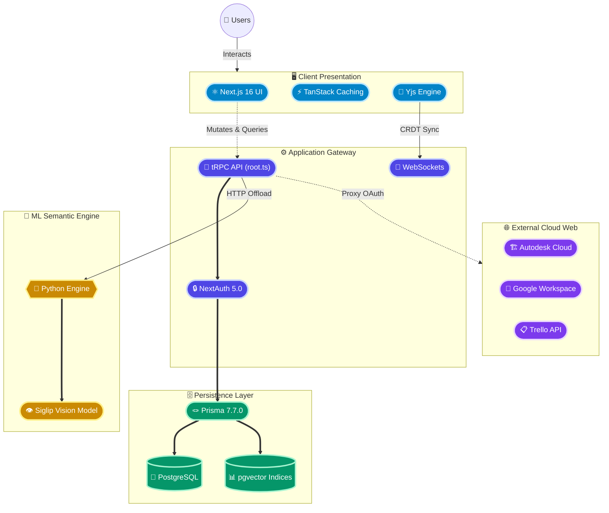
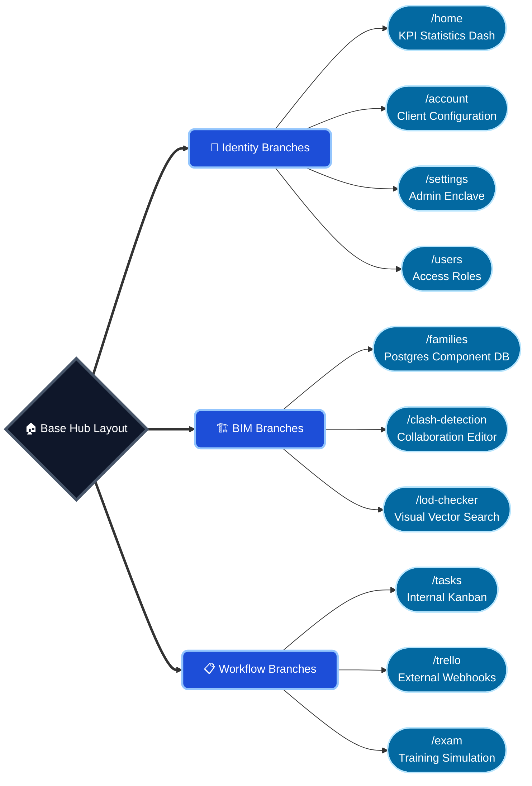
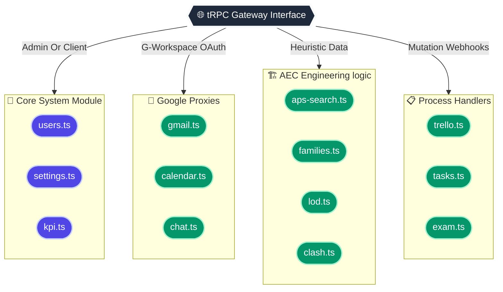

# Architecture - LECG Dashboard

> A high-fidelity, completely visual map of the LECG Dashboard topology, built purely with structural flowcharts.

## 1. Global Platform Topology
*A C4-style architectural view showing how the React client, Node.js backend, Python ML inference, and external clouds physically interconnect.*

## 2. Next.js Routing Map
*A highly organized breakdown of the App Router, showing exactly how the 11 specific dashboard systems branch out from the structural root layout.*

## 3. The Backend Router Matrix
*A visualization of exactly how the core `tRPC` api branches into domain-isolated subsystems to handle specific logic without circular dependencies.*

