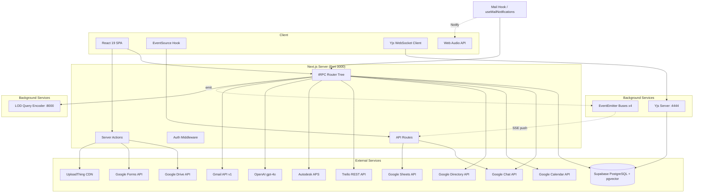

# Architecture - LECG Dashboard

> Auto-generated by Antigravity on 2026-04-15 (Nuclear Deep Phase)
> Updated: 2026-04-16 — LOD Checker, apsSearch router, Python encoder service, auth/KPI fixes verified

## Overview

The LECG Dashboard is a high-fidelity BIM management and synchronization platform built on **Next.js 15 (App Router)** and **tRPC**. It provides a unified portal for tracking parametric families, managing clash detection workflows, evaluating Revit exam results, and synchronizing with external services (Google Workspace, Trello, Autodesk APS, OpenAI).

---

## System Topology



---

## tRPC Router Tree (15 Routers, 3 Protection Tiers)

The root router (`server/routers/root.ts`) composes 15 domain routers:

```text
appRouter
├── project          (protectedProcedure)     — Singleton project CRUD
├── families         (protected/editor/admin)  — Family lifecycle + APS upload
├── clash            (protected/editor)        — Wiki + Task CRUD + SSE events
├── sim              (protected/editor)        — Mirror of clash (wiki + task)
├── exam             (protected/editor/admin)  — Exam builder + Google Forms
├── kpi              (protectedProcedure)     — Dashboard analytics aggregation
├── tasks            (protectedProcedure)     — Personal task management
├── search           (protectedProcedure)     — Cross-module global search
├── users            (admin/protected)         — User MGMT + permissions + sheets sync
├── trello           (protected/editor)        — Board/card/checklist sync
├── calendar         (protectedProcedure)     — Google Calendar events + rooms
├── chat             (protectedProcedure)     — Google Chat spaces + messages
├── lod              (protectedProcedure)     — LOD Checker: pgvector search, stats, CRUD, upload
├── apsSearch        (protectedProcedure)     — APS folder BFS traversal + Revit model discovery
├── gmail            (protectedProcedure)     — Gmail inbox/send service
└── (type export)    AppRouter
```

### Procedure Protection Tiers

| Tier | Guard | Access |
| --- | --- | --- |
| `publicProcedure` | None | Unrestricted (unused in production) |
| `protectedProcedure` | `session.user` exists | Any authenticated user |
| `editorProcedure` | Role ∈ {`EDITOR`, `ADMIN`} | Write access to modules |
| `adminProcedure` | Role = `ADMIN` | User management, system config |

### Context Injection

Every tRPC procedure receives a context with:

- `session` — Cached via `react.cache(() => auth())` to deduplicate per-request
- `db` — Prisma singleton (hot-module-reload safe via `globalThis`)
- `projectId` — Process-lifetime cached singleton project ID

---

## Authentication System (4 Providers)

### Provider Configuration (`server/auth.ts`)

| Provider | ID | OAuth Scopes | Notes |
| --- | --- | --- | --- |
| **Google (Primary)** | `google` | openid, email, profile, calendar, chat.messages, chat.spaces.readonly, directory.readonly | Primary identity + Calendar/Chat/Directory |
| **Google Chat** | `google-chat` | openid, email, profile, chat.memberships.readonly, chat.messages, chat.spaces.readonly | Separate client for Chat-specific scopes |
| **Autodesk** | `autodesk` | openid, data:read, viewables:read, user:read, account:read | APS model access, PKCE + state checks |
| **Credentials** | `credentials` | N/A | Username/email + bcrypt password |

### Admin Alias System

The `signIn` callback implements **email aliasing**: if the incoming email matches `ADMIN_EMAIL` or the `ADMIN_EMAIL_ALIAS` env var, all OAuth accounts are force-linked to the primary admin user record. This enables multi-org admin access from a single identity.

### JWT Lifecycle (Real-Time Role Refresh)

On **every JWT rotation**, the system:

1. Queries `User.role` and `User.password` from the database
2. Queries all linked `Account.provider` entries
3. Calls `db.userModuleAccess.findMany({ where: { userId } })` — previously raw SQL, now Prisma
4. Injects `role`, `providers[]`, `hasCredentials`, `moduleAccess[]` into the token

This means **admin role changes take effect without re-login**.

### Whitelist Gate (Sheets-Backed)

Non-admin users must pass `isEmailApproved()` during first sign-in:

1. **Blacklist check** — `Blacklist!A:A` sheet scan (5m TTL cache)
2. **Fast path** — `ApprovedEmail` table (Prisma `findUnique`)
3. **Slow path** — `Approved!A:A` sheet scan + background `syncWhitelist()` upsert
4. **Rejection** — `enqueuePendingUser()` appends to `Pending!A:E` sheet

---

## Event Bus Architecture (4 Singleton Emitters)

Each event bus is a process-global `EventEmitter` with `setMaxListeners(0)`:

### `clashEvents` (`lib/clash-events.ts`)

| Event Type | Payload | Trigger |
| --- | --- | --- |
| `wiki-upsert` | `{projectId, wiki: {id, section, title, content, status, order}}` | Wiki create/update |
| `wiki-status` | `{projectId, wiki: {id, section, status}}` | Status transition |
| `wiki-deleted` | `{projectId, section}` | Wiki deletion |
| `wiki-list-reordered` | `{projectId}` | Drag-and-drop reorder |
| `task-created` | `{projectId, task: {id, status, order, title, ...}}` | Task creation |
| `task-updated` | `{projectId, task: {id, status, order, title, ...}}` | Task mutation |
| `task-deleted` | `{projectId, taskId}` | Task archival |

### `simEvents` (`lib/sim-events.ts`)

Identical schema to `clashEvents` — a structural clone for the Simulation module.

### `trelloEvents` (`lib/trello-events.ts`)

| Event Type | Payload |
| --- | --- |
| `check-item-created` | `{timestamp}` |
| `check-item-toggled` | `{timestamp}` |
| `check-item-deleted` | `{timestamp}` |
| `card-created` | `{timestamp}` |
| `card-updated` | `{timestamp}` |

### `userEvents` (`lib/user-events.ts`)

| Event Type | Payload |
| --- | --- |
| `role-updated` | `{userId, role}` |
| `module-access-updated` | `{userId, modules[]}` |
| `user-blacklisted` | `{userId}` |
| `user-removed` | `{userId}` |
| `user-linked` | `{userId, provider}` |

---

## Real-Time Subsystems

### SSE Stream (`/api/chat/stream`)

Server-side `ReadableStream` that polls Google Chat:

- **Polling**: 5s interval, most recent 10 spaces
- **Batching**: Sequential, batch size 3
- **Heartbeat**: `: keep-alive\n\n` every 20s
- **Headers**: `X-Accel-Buffering: no`, `Cache-Control: no-cache, no-transform`
- **Client retry**: `retry: 5000`

### Client-Side Notification Pipeline (`use-chat-notifications.ts`)

```
SSE Event → Deduplication (50-item Set) → Unread Map Update
                                        → tRPC Invalidation (spaces + messages)
                                        → Web Audio Ping (880Hz→440Hz sine, 0.5s)
                                        → Browser Notification API
```

The **Web Audio** notification sound is synthesized at runtime (no mp3 files):

- Oscillator: sine wave, 880Hz → 440Hz exponential ramp over 200ms
- Gain: 0 → 0.45 linear ramp (10ms attack), exponential decay to 0.001 over 400ms
- Burst spacing: 250ms between consecutive pings
- Auto-primed on first user gesture (click/keydown) to bypass browser autoplay policy

### SSE Client Hook (`use-event-source.ts`)

Reconnection with **exponential backoff**:

```text
- Base delay: 2000ms
- Growth factor: 1.5x per retry
- Max delay: 30,000ms
- Max retries: 10
```

- **Visibility recovery**: Reconnects on `document.visibilityState === "visible"` after sleep

### Integrated Gmail Service (Floating Left)

- **Monitor**: `useMailNotifications` hook polls `trpc.gmail.getRecent` every 60s.
- **Audio Feedback**: 1046.5Hz → 523.25Hz (C6→C5) exponential sine ramp (Mail Ping).
- **Security**: Bound to `GMAIL_USER` shared organizational credentials.
- **Layout**: Positioned `fixed bottom-5 left-5` to mirror the Chat button.

### Yjs WebSocket Server (Port 4444)

- Hydrates `Y.Doc` from `ClashWiki.yjsState` / `SimWiki.yjsState` (Bytea)
- Persists CRDT state back to database on document close
- NextAuth session token validation for WebSocket auth

---

## Google Workspace Integration Matrix

### OAuth Identity Resolution

The system maintains **3 separate OAuth client configurations**:

| Config | Resolution Logic | Purpose |
| --- | --- | --- |
| **Primary Google** | `GOOGLE_CLIENT_ID` / `GOOGLE_CLIENT_SECRET` | User auth + Calendar |
| **Google Chat** | Cascade: `GOOGLE_CHAT_CLIENT_ID` → `GOOGLE_CLOUD_CLIENT-ID` → `GOOGLE_CLIENT_ID` | Chat-specific scopes |
| **Google Drive/Gmail** | Cascade: `GMAIL_OAUTH_CLIENT_ID` → `GOOGLE_CLIENT_ID-FOR-MAIL` → `GOOGLE_CLIENT_ID` | Email delivery |

### Service Account Credential Decryption (`resolveServiceAccountCredentials`)

`GOOGLE_SERVICE_ACCOUNT_KEY` is resolved through a 4-stage cascade:

1. **Direct JSON parse** (`tryParseJsonObject`)
2. **File path resolution** (`tryParseJsonFromFile`) — handles `.json` paths
3. **Base64 decode** (`tryDecodeBase64`) → then JSON parse
4. **Split key fallback** — raw PEM key + `GOOGLE_SERVICE_ACCOUNT_EMAIL`

Rejects OAuth client JSON (`web`/`installed` keys) with a descriptive error.

### Token Lifecycle (`buildUserCalendarAuth`)

OAuth tokens are refreshed automatically via the `googleapis` library's `on("tokens")` event listener. When refreshed tokens are emitted:

- `access_token`, `expires_at`, and `refresh_token` are persisted to the `Account` table
- Only non-null fields are written (avoids clobbering existing refresh tokens)

### Google Calendar — Room Discovery Heuristic

Since the system operates without Google Workspace Admin API access, it discovers meeting rooms through **two parallel strategies**:

1. **Subscribed rooms** — `calendarList.list({ minAccessRole: "freeBusyReader" })`, filtering for `@resource.calendar.google.com` emails
2. **Event-attendee mining** — Scans 6 months of events (±3 months), extracting resource email attendees

Results are merged with subscribed rooms taking priority (better metadata).

### FreeBusy Status Check

Uses a 5-minute rolling window to determine if directory users are currently in meetings — feeds the "busy" indicator in the people directory UI.

---

## Integration Error Handling Framework

### `IntegrationError` Class (`lib/server/integration-errors.ts`)

Custom error type with structured classification:

| Code | HTTP Status | Trigger |
| --- | --- | --- |
| `reconnect_required` | 401/403 | Invalid grant, insufficient permissions, expired tokens |
| `config_missing` | 500 | Missing env vars ("not configured", "missing google") |
| `unavailable` | 502 | Transient API failures |

### Google API Error Summarization (`summarizeGoogleApiError`)

Deeply traverses the nested Google API error structure:

```
error.response.data.error.errors[].reason → reasons[]
error.response.data.error.message → message
error.response.status → statusCode
```

---

## Structured Logging (`lib/server/logger.ts`)

Factory-based scoped logger (`createLogger("scope")`):

- **Format**: JSON structured logs with `{ts, level, scope, message, meta}`
- **Levels**: debug (dev-only), info, warn, error
- **Safety**: Circular reference detection via `WeakSet`, BigInt/Date serialization
- **Error serialization**: Extracts `name`, `message`, `code`, `stack`

---

## Data Domain: BIM Category Registry

`lib/categories.ts` contains a **114-category Revit taxonomy**, organized into 8 groups:

| Group | Count | Examples |
| --- | --- | --- |
| Structural | 15 | Columns, Foundations, Rebar |
| Architectural | 23 | Doors, Windows, Walls, Stairs |
| MEP — Mechanical | 16 | Ducts, Air Terminals, Equipment |
| MEP — Electrical | 16 | Cable Trays, Lighting, Conduit |
| MEP — Plumbing & Fire | 11 | Pipes, Sprinklers, Fixtures |
| Site & Infrastructure | 13 | Roads, Parking, Topography |
| Furniture & Equipment | 6 | Furniture, Medical Equipment |
| Other | 12 | Generic Models, Detail Items |

---

## Wiki System

### Default Sections (`lib/wiki-sections.ts`)

Each Clash/Sim wiki is initialized with 6 sections:

| Key | Title | Order |
| --- | --- | --- |
| `inputs` | Inputs | 0 |
| `naming` | Naming Conventions | 1 |
| `responsibilities` | Responsibilities | 2 |
| `qa-gates` | QA Gates | 3 |
| `acc-placement` | ACC Placement | 4 |
| `definition-of-done` | Definition of Done | 5 |

### Section Key Isolation (`lib/wiki-utils.ts`)

`ensureUniqueSection(projectId, section)` prefixes each section key with the project ID to prevent cross-project collisions in the shared wiki table.

### Advanced Media Pipeline (`WikiEditor.tsx`)

- **Parallelization**: Migration from serial `for` loops to `Promise.all` for multi-file paste.
- **Optimistic UI**: Integration of `URL.createObjectURL` for immediate user feedback.
- **Node Refresh**: Dynamic lookup of temporary `id` attributes to perform atomic URL replacement.

### Synchronization Layer (`yjs-server.cjs`)

- **Auth Guard**: NextAuth session validation during WebSocket handshaking.
- **Persistence**: Debounced Bytea updates to PostgreSQL (Supabase).

### Data Service Layer (`lib/email.ts`)

- **Retrieval Engine**: Integration of `gmail.users.messages.list` and `get`.
- **MIME Parsing**: Multi-part body resolution (HTML priority).

### UI Subsystem (`components/dashboard/*`)

- **MailPanel**: View state machine (Inbox -> Detail -> Compose).
- **MailService**: Floating entry point with mirroring logic for the Chat FAB.
- **MailPanelProvider**: Dedicated context for visibility and navigation state.

---

## KPI Analytics Engine (`server/routers/kpi.ts`)

### `getHomeDashboard` — Consolidated Query Aggregation

Originally 17 parallel Prisma queries; refactored to use a raw SQL CTE for the 10 count queries, reducing connection pool checkouts from 17 to ~8 per homepage load. Remaining queries in a single `Promise.all`:

1. Family total / done / review counts
2. Clash task total / done / review counts
3. Exam results (up to 500 for pass-rate calculation)
4. Exam build task count
5. Next 5 family deadlines
6. Next 5 clash deadlines
7. Recent 5 families (activity feed)
8. Recent 5 changelogs (activity feed)
9. Recent 3 clash tasks (activity feed)
10. Recent 3 exam results (activity feed)
11. User count
12. Deliverable total / done counts

**Derived metrics**:

- **Capacity**: `min(100, round((activeTasks / (userCount × 8)) × 100))` — assumes 8 tasks/person
- **Pass rate**: Percentage of exam results with score/maxScore ≥ 0.7
- **Velocity**: 3-axis (modeling/documentation/QA) progress percentages

---

---

## LOD Checker Architecture

### Data Model (`prisma/schema.prisma`)

| Model | Purpose |
| --- | --- |
| `LodFamily` | 24,619 BIM families with `embedding vector(768)`, `finalCategory`, `lodLabel`, `provider` |
| `LodImage` | Image references per family (Google Drive fileId) |
| `LodParameter` | Key-value parameters per family |
| `LodParameterGroup` | Grouped parameter metadata |
| `ApsProjectSearchCache` | 1h TTL cache for APS folder BFS results |

### Semantic Search (`server/routers/lod.ts`)

pgvector IVFFlat index (`vector_cosine_ops`) on `LodFamily.embedding`. Search pipeline:

1. User query → **LOD Query Encoder** service (`lib/server/lod-query-encoder.ts`) → 768-dim SigLIP vector
2. Prisma `$queryRaw` with `<=>` cosine distance operator → top-K results
3. Results include similarity score, category, LOD label, provider

### Performance & GPU Affinity

The LOD subsystem is designed for **CUDA-first** execution:

- **Hardware**: NVIDIA GPU with CUDA 12.x support (via `torch.cuda`).
- **Orchestration**: Parallel inference with automatic CPU fallback.
- **Optimization Strategy**: ONNX Runtime + FP16 Half-Precision (Planned).
- **Latency Target**: < 500ms end-to-end vector search.

Encoder service: Python FastAPI at `LOD_QUERY_ENCODER_URL`, 15s timeout, validated with Zod schema (`vector: z.array(z.number()).length(768)`).

### Graph Canvas (`components/lod/LodGraphCanvas.tsx`)

Canvas-based UMAP scatter plot of all 23,965 embeddings:

- **Rendering**: HTML5 Canvas with manual zoom/pan (transform matrix)
- **Color**: Stable category hash → HSL hue (deterministic per category string)
- **Interaction**: Click node → opens `LodDetailPanel` for that family
- **Tab system**: Search ↔ Graph toggle on the LOD Checker page

### APS Folder Search (`server/routers/aps-search.ts`)

BFS traversal of APS project folder trees:

- **Concurrency**: `pLimit(3)` — max 3 parallel folder fetches
- **Timeout**: `Promise.race` with 60s hard limit
- **Cache**: `ApsProjectSearchCache` model (1h TTL per project)
- **Output**: `ApsRevitModel[]` with full `folderPath` breadcrumbs

### Image Proxy (`app/api/lod-img/[fileId]/route.ts`)

Google Drive image proxy with 24h browser cache (`Cache-Control: public, max-age=86400`). Streams full-res PNGs from Drive — avoids UploadThing costs for the 37GB image library.

---

## Global Search (`server/routers/search.ts`)

Cross-module parallel search across 3 entity types:

- **Families**: by `name` or `category` (case-sensitive `contains`)
- **UserTasks**: by `title` or `description` (scoped to current user for privacy)
- **ClashTasks**: by `title` or `description`

Also exposes `getApsToken` — a lazy-imported APS token endpoint.

---

## Email Templates (6 Transactional Templates)

All emails use inline-CSS HTML and are sent via Gmail OAuth (`lib/email.ts`):

| Function | Subject | Purpose |
| --- | --- | --- |
| `sendPasswordResetEmail` | "Reset your BIM Dashboard password" | 1-hour expiry reset link |
| `sendWelcomeEmail` | "Welcome to BIM Dashboard" | Post-registration confirmation |
| `sendPendingRequestEmail` | "Your BIM Dashboard access request is pending" | Whitelist queue notification |
| `sendApprovedEmail` | "Your BIM Dashboard access has been approved" | Login link after admin approval |
| `sendDeclinedEmail` | "Your BIM Dashboard access request was not approved" | Rejection notification |
| `sendAdminNotificationEmail` | "New Access Request: {name}" | Admin alert for new requests |

---

## Route Map

### App Router Pages

```
app/
├── (auth)/                    — Auth layout (login, register)
├── (dashboard)/
│   ├── home/                  — KPI dashboard
│   ├── families/              — Family CRUD + APS viewer
│   ├── clash-detection/       — Clash wiki + task board
│   ├── sim-automation/        — Sim wiki + task board
│   ├── exam/                  — Exam builder + results
│   ├── trello/                — Trello board sync
│   ├── tasks/                 — Personal task list
│   ├── lod-checker/           — LOD validation tool
│   ├── account/               — User profile + provider linking
│   ├── settings/              — App settings
│   └── users/                 — User management (admin)
└── api/
    ├── trpc/                  — tRPC HTTP handler
    ├── auth/                  — NextAuth routes
    ├── chat/stream/           — SSE stream endpoint
    ├── clash-updates/         — Clash SSE stream
    ├── sim-updates/           — Sim SSE stream
    ├── events/                — Generic event stream
    ├── ai/                    — AI generation endpoint
    ├── connect/               — OAuth connect flow
    ├── debug/                 — Debug utilities
    ├── uploadthing/           — File upload handler
    ├── wiki-media/            — Wiki media proxy
    ├── lod-img/[fileId]/      — Google Drive image proxy (24h cache)
    └── health/                — Railway health check (`GET → {status, timestamp, node}`)
```

---

## Client Hook Inventory

| Hook | Purpose | Key Implementation Detail |
| --- | --- | --- |
| `useEventSource` | Generic SSE subscription | Exponential backoff (2s base, 1.5x, 30s cap, 10 retries) |
| `useChatPulse` | Chat SSE → tRPC invalidation | 50-item dedup Set + `useUtils().invalidate()` |
| `useChatNotifications` | Full notification pipeline | Unread map + Web Audio + Browser Notifications |
| `useRole` | Role-based UI gating | Delegates to `DashboardAuthProvider` context |
| `useDebounce` | Input debouncing | 500ms default delay |

---

## Deployment Architecture

| Component | Provider | Port/URL | Protocol |
| --- | --- | --- | --- |
| Dashboard | Railway (Nixpacks, Node 20) | 3000 | HTTPS / SSE |
| Database | Supabase (+ pgvector extension) | 6543 (pooled) / 5432 (direct) | PostgreSQL |
| Yjs Server | Co-located Node.js | 4444 | WebSocket |
| LOD Query Encoder | Python FastAPI (`services/lod-query-encoder/`) | `LOD_QUERY_ENCODER_URL` | HTTP REST |
| File Storage | UploadThing CDN | External | HTTPS |
| APS Viewer | Autodesk CDN | External | HTTPS |

### Environment Variable Hierarchy (30+ vars)

| Category | Variables | Source |
| --- | --- | --- |
| **Database** | `DATABASE_URL`, `DIRECT_URL` | Supabase connection strings |
| **Auth** | `AUTH_SECRET`, `NEXTAUTH_SECRET`, `AUTH_TRUST_HOST`, `AUTH_URL` | NextAuth v5 |
| **Google OAuth** | `GOOGLE_CLIENT_ID`, `GOOGLE_CLIENT_SECRET` | GCP Console |
| **Google Service** | `GOOGLE_SERVICE_ACCOUNT_EMAIL`, `GOOGLE_SERVICE_ACCOUNT_KEY` | Service account JSON |
| **Google Resources** | `GOOGLE_DRIVE_FOLDER_ID`, `GOOGLE_SHEETS_ID`, `GOOGLE_CLOUD_PROJECT` | Resource IDs |
| **Autodesk** | `APS_CLIENT_ID`, `APS_CLIENT_SECRET`, `APS_CALLBACK_URL`, `APS_SCOPES` | APS app |
| **Trello** | `TRELLO_API_KEY`, `TRELLO_TOKEN` | Trello power-up |
| **OpenAI** | `OPENAI_API_KEY`, `OPENAI_MODEL` | GPT-4o access |
| **UploadThing** | `UPLOADTHING_SECRET`, `UPLOADTHING_APP_ID`, `UPLOADTHING_TOKEN` | File CDN |
| **Email** | ~~`RESEND_API_KEY`, `RESEND_EMAIL`~~ | Dead — email moved to Gmail OAuth; remove from Railway |
| **Admin** | `ADMIN_EMAIL`, `ADMIN_EMAIL_ALIAS` | Primary + secondary admin identities |
| **LOD** | `LOD_QUERY_ENCODER_URL`, `LOD_QUERY_ENCODER_VERSION` | Python SigLIP encoder service |
| **Runtime** | `NIXPACKS_NODE_VERSION` | Railway builder |
