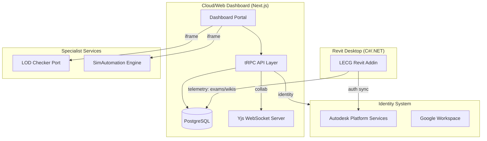

# Architecture - LECG Dashboard

> Auto-generated by Antigravity on 2026-04-15 (Master Ecosystem Phase)

## Overview

The LECG Dashboard is the **Command & Control Hub** for the LECG Revit Automation Suite. It centralizes the management of parametric families, clash detection workflows, automated SIM tasks, and Revit competency results from the desktop Addin.

## LECG Ecosystem Topology

The Dashboard serves as the unified interface for a distributed suite of BIM tools:
- **LECG Revit Addin (C#)**: The primary data producer. It runs natively in Autodesk Revit, allowing users to take exams and update wiki content directly from the modeling environment.
- **Dashboard Portal (Next.js)**: The administrative and management hub. It coordinates permissions, reviews results, and hosts specialized analytical views.
- **LOD Checker (Vite/Flask)**: An integrated specialized service for Level of Development (LOD) analytics.
- **SimAutomation**: The automation engine for Batch processing and SIM tasks.

## Desktop-to-Web Telemetry

The ecosystem uses a **Shared Data Layer** (PostgreSQL) to synchronize state between the Revit Addin and the cloud Dashboard.
- **Revit Exams**: Candidates take exams within the Revit Addin. Progress and final scores are pushed to the `revitExam` and `examResult` entities in the database for admin review in the dashboard.
- **Wiki Synchronization**: Collaborative wiki content authored in the Addin is persisted as binary Yjs state, which the Dashboard's Yjs server (`yjs-server.cjs`) then hydrates for sub-millisecond web view consistency.

## Operational Philosophy

### Context-Singleton Pattern

The system implements a specialized `createTRPCContext` in `server/trpc.ts`. For every request, the context:
- Ensures a valid **Session** is present.
- Fetches/Initializes a **Project Singleton**. If no project exists in the database, the system automatically creates a "Default Project" and caches its ID for the process lifetime.

### Tiered Procedure Protection

Access to API procedures is strictly enforced via three primary tRPC middleware layers:
- **`protectedProcedure`**: Requires a valid user session.
- **`editorProcedure`**: Requires either an `EDITOR` or `ADMIN` role.
- **`adminProcedure`**: Exclusive to users with the `ADMIN` role.

The `middleware.ts` layer provides an additional perimeter check on the edge, decoding the JWT to prevent unauthorized module-level initial navigation.

## Advanced Data Patterns

### Event-Driven Signaling

The `lib/user-events.ts` singleton provides an internal `EventEmitter` for reactive cross-service signaling.
- **Usage**: When a user's role or module access is updated, or when an account is linked, the system emits events that other internal services can subscribe to without tight coupling.

### Single-Flight Caching

The `Google Directory` service (`lib/google-directory.ts`) implements a sophisticated caching strategy to stabilize the platform's relationship with external APIs.
- **Single-Flight**: Prevents redundant, concurrent API calls for the same data by deduplicating in-flight promises.
- **Multi-Layer Cache**: Combines short-term memory caches for frequent lookups (5m TTL) with persistent session-linked tokens.

## Real-time Collaboration (Yjs)

The wiki modules utilize a standalone WebSocket server (`scripts/yjs-server.cjs`) to facilitate real-time editing.
- **Binary Sync**: All edits are handled via CRDT binary updates, ensuring conflict-free merging between Desktop and Web peers.
- **Direct Persistence**: The Yjs server bypasses the main Next.js API, using its own Prisma instance to perform debounced saves (3-second delay) of the `yjsState` bytes directly into the `ClashWiki` or `SimWiki` models.

## Conventions

- **Naming**: PascalCase for components, camelCase for variables/functions, kebab-case for CSS classes.
- **Structure**: Features grouped in `app/` (dashboard routes) and shared logic in `lib/`.
- **Auth**: Managed via **NextAuth v5 beta**, using Prisma adapter.
