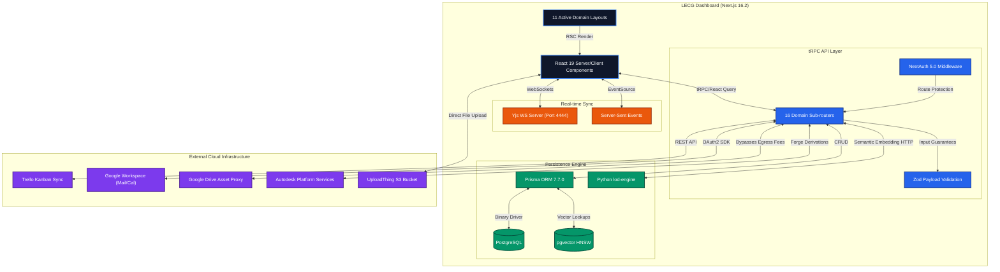

# Architecture - LECG Dashboard

> Auto-generated by /map mapping actual filesystem architecture on 2026-04-17 (Post-Sonnet Refactor Sprint)

## Overview
The LECG Dashboard is an enterprise-grade BIM Project infrastructure hub built on Next.js 16.2 App Router. It features real-time task sync, semantic visualization, and an adaptive layout integrating 11 active domains across frontend, backend, and external cloud services. All legacy tech debt trackers have been cleared; this map represents the live, verified structure currently executing in production.

## Frontend Components & Pages

### Entry Points (`app/(dashboard)/*`)
The application is clustered into 11 strictly partitioned functional modules. Each is a server-component entry point wrapping client logic:
- `/account`, `/users`: Identity management.
- `/clash-detection`: Yjs Wiki Collaboration + Forge Model integrations.
- `/exam`, `/sim-automation`: Training and Revit simulator execution workflows.
- `/families`: Family/BIM library interface pulling from Postgres.
- `/home`: KPI aggregate widget screen.
- `/lod-checker`: Visual similarity engine interface.
- `/tasks`, `/trello`: Kanban organization and direct Trello synchronizations.
- `/settings`: Per-user feature flags and admin routing.

### UI Subsystems (`components/*`)
- **Resilience Layer:** Core architecture enforces `PanelErrorBoundary` and `PageSkeleton` logic to prevent CLS and isolate deep react tree exceptions.
- **Collaborative Editor:** `components/clash/WikiEditor.tsx` acts as the `tiptap` / `y-webrtc` root.
- **Visuals:** Integrates `framer-motion` for complex physics interactions across panels.

## Backend Data Flow (tRPC API Layer)

The API relies entirely on `@trpc/server` hosted at `root.ts`. It splits into 16 hyper-specialized domains:

1. **`aps-search.ts`**, **`project.ts`**: Resolve BIM 360 models, metadata, and folders.
2. **`calendar.ts`**, **`gmail.ts`**, **`chat.ts`**: Google Workspace interoperability.
3. **`trello.ts`**, **`tasks.ts`**: Dual-layer Kanban (DB local vs API synchronized).
4. **`lod.ts`**: Proxies requests to the Python native `lod-engine` inference API returning `pgvector` nearest neighbor indices. 
5. **`kpi.ts`**: Aggregation pipeline powering the `/home` telemetry.
6. **`users.ts`**, **`exam.ts`**, **`families.ts`**, **`sim.ts`**, **`clash.ts`**: Core CRUD.

### Shared Utility Flow (`lib/*`)
Instead of monolithic utils, logic is isolated via domain clusters:
- `lib/google/`: OAuth token cycling and directory proxies.
- `lib/events/`: Emitters handling multi-tenant event notifications.
- `lib/server/`: Internal auth-guard functions and `IntegrationError` mappers.

## Integration Points

| Service | Protocol | Core Purpose | Map Location |
|---------|----------|--------------|--------------|
| **Postgres + pgvector** | Prisma Binary | Relational persistence & Semantic vectors | `prisma/schema.prisma` |
| **Autodesk APS** | REST / OAuth2 | Rendering 3D derivative geometries | `server/routers/aps-search.ts` |
| **Google APIs** | OAuth2 / SDK | Mail / Calendar / FreeBusy inference | `server/routers/gmail.ts` |
| **Trello** | REST | Syncing issue metadata and comments | `server/routers/trello.ts` |
| **Google Drive** | REST Proxy | Proxied via `/api/lod-img/` to sidestep bandwidth fees | `app/api/lod-img/[...fileId]` |
| **Python ML Engine**| HTTP Local | Image evaluation (Siglip) | `services/lod-engine/` |

## Structural Truths & Conventions

- **Next.js Paradigms:** Operates deeply on RSC (React Server Components) for all `page.tsx` shells, dropping into `"use client"` blocks exclusively for Tanstack Query mutators or tiptap interactive clusters.
- **Strong Typing:** Server payloads are completely secured by `zod` boundaries. There are no loose inputs in the `server` namespace.
- **Zero-Trust Middlewares:** `/api/health` and designated webhooks bypass `NextAuth` via explicit `PUBLIC_PATHS` matchers.
- **Secret Hygiene:** Environment keys are segmented between explicit client exposures (`NEXT_PUBLIC_`) and strict server bounds.
