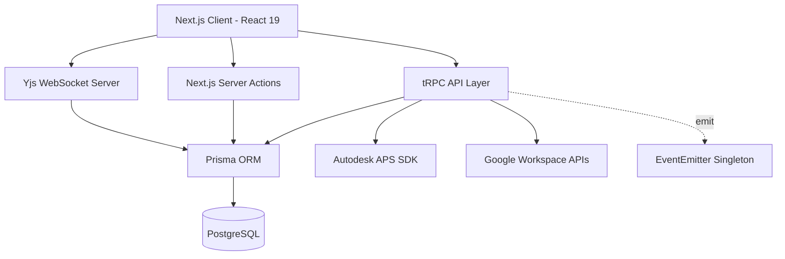

# Architecture - LECG Dashboard

> Auto-generated by Antigravity on 2026-04-15 (Master Internal Phase)

## Overview

The LECG Dashboard is a high-fidelity BIM management and synchronization platform built on **Next.js 15 (App Router)** and **tRPC**. It provides a unified portal for tracking parametric families, managing clash detection workflows, and evaluating Revit exam results.

## Internal Data Model (Prisma)

The application utilizes a relational PostgreSQL database managed via **Prisma**. The schema is organized into four primary functional segments:

### 1. Identity & Auth
- **`User` / `Account` / `Session`**: Standard NextAuth v5 models.
- **`ApprovedEmail` / `PendingRequest`**: Implements a custom "Whitelist" onboarding system where new sign-ups are held in `PENDING` state until their email matches an `ApprovedEmail` entry.
- **`UserModuleAccess`**: A granular join table linking users to specific BIM modules (Families, Clash, Sim).

### 2. Multi-Project Structure
- **`Project`**: The root-level unit for data isolation. All operational data (Families, Tasks, Wikis) is linked to a `Project` ID.
- **Project Singleton**: While the schema supports multiple projects, the system currently initializes a **"Default Project"** singleton in the `createTRPCContext` logic.

### 3. Operational Modules

| Module | Core Models | Key Data Features |
|--------|-------------|-------------------|
| **Families** | `Family`, `Changelog`, `Deliverable` | Attachment tracking (Img/Vid), Versioning |
| **Clash** | `ClashWiki`, `ClashTask` | Yjs Binary sync, Task milestone tracking |
| **Sim** | `SimWiki`, `SimTask` | **Functional Clone** of the Clash module |
| **Exams** | `RevitExam`, `ExamBuildTask`, `ExamResult` | Multi-candidate scoring & results tracking |

### 4. Task Management
- **`UserTask` / `TaskAttachment`**: A localized to-do system with priority levels (`TODO` | `IN_PROGRESS` | `DONE`) and deadline tracking.

## Internal State Machines

The system relies on explicit string-based status enums for its core workflows:

- **BIM Families Phase**: `TODO` → `IN_PROGRESS` → `REVIEW` → `DONE`.
- **APS Processing**: `NONE` → `PROCESSING` → `SUCCESS` → `FAILED` (Tracks Autodesk SVF/URN derivation).
- **Exam Status**: `PLANNING` → `ACTIVE` → `COMPLETED`.
- **Clash Wiki Status**: `DRAFT` → `REVIEW` → `APPROVED`.

## Operational Logic

### Context-Singleton Pattern
The `server/trpc.ts` layer ensures that every request is context-aware:
- Automatically initializes a "Default Project" if the database is empty.
- Caches the `projectId` for the process lifetime to minimize redundant lookups.

### Tiered Protection
- **`protectedProcedure`**: Session required.
- **`editorProcedure`**: `EDITOR` or `ADMIN` role required.
- **`adminProcedure`**: `ADMIN` role required.

## Technical Detail: Yjs Binary Persistence
The wiki modules use a standalone server (`scripts/yjs-server.cjs`) to sync `Bytes` data directly to the database.
- **Sync**: Binary CRDT updates are broadcast to peers.
- **Hydration**: The `yjsState` field in `ClashWiki` and `SimWiki` stores the definitive document state, bypassing standard text serializations.

## Architecture Guidelines

- **Module Redundancy**: Documenting the explicit duplication between `Sim` and `Clash` modules for potential future abstraction into a `BaseModule` pattern.
- **Naming**: CUID strategy for most IDs to ensure cross-service uniqueness.
- **Event-Driven UI**: `EventEmitter` singleton handles cross-service state signaling in the tRPC context.
