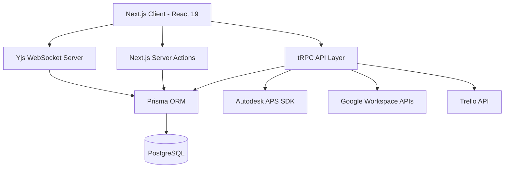

# Architecture - LECG Dashboard

> Auto-generated by Antigravity on 2026-04-15

## Overview

The LECG Dashboard is a comprehensive BIM management and synchronization platform. It serves as a central hub for tracking parametric families, managing clash detection workflows, automating SIM tasks, and conducting Revit competency exams.

The system is built on **Next.js 15 (App Router)** and utilizes a **tRPC** API layer for type-safe communication between the frontend and the PostgreSQL database.

## Core Components

### 1. Frontend (`app/`, `components/`)

- **App Router**: Managed navigation and layout state.
- **Shared UI**: Built with **Tailwind CSS 4**, **Radix UI**, and **Shadcn**.
- **Real-time Collaboration**: **Tiptap** editors synced via **Yjs** for Wiki modules.

### 2. API Layer (`server/routers/`)

- **Root Router**: Entry point in `server/routers/root.ts`.
- **Feature Routers**: Modular routers for `families`, `clash`, `sim`, `tasks`, `users`, `trello`, `calendar`, `chat`, etc.
- **Type Safety**: End-to-end Zod validation for all procedures.

### 3. Service Integrations (`lib/`)

- **APS Service**: Handles Autodesk authentication, model derivatives, and OSS storage.
- **Google Service**: Comprehensive suite for Calendar, Chat (notifications), Directory (user management), and Drive.
- **Trello Service**: Syncs tasks and events with Trello boards.
- **AI Service**: Integration with OpenAI for automated insights.

### 4. Data Layer (`prisma/`)

- **Schema**: Relational model defined in `prisma/schema.prisma`.
- **Migration Management**: Managed via Prisma Migrate.
- **Yjs Persistence**: Binary Yjs state stored in PostgreSQL for wiki hydration.

## Data Flow

1. **Request**: User interacts with a component (e.g., updating a Family phase).
2. **API Call**: Component triggers a tRPC mutation.
3. **Business Logic**: The router procedure validates input (Zod) and calls appropriate lib services.
4. **Persistence**: Prisma updates the database.
5. **External Sync**: (Optional) Service calls external APIs (APS, Google) and triggers event notifications (e.g., via `clash-events.ts`).
6. **Response**: UI updates optimistically or via React Query invalidation.

## Integration Points

| Service | Type | Purpose | Source File |
|---------|------|---------|-------------|
| Autodesk APS | API / SDK | BIM model viewing and metadata | `lib/aps.ts` |
| Google Chat | Webhook / API | Real-time notifications | `lib/google-chat.ts` |
| Google Calendar | API | Schedule tracking | `lib/google-calendar.ts` |
| Trello | API | External task management | `lib/trello.ts` |
| OpenAI | API | Augmented intelligence | `lib/ai.ts` |
| UploadThing | SaaS | Secure file uploads | `app/api/uploadthing/route.ts` |

## Technical Debt

### Identified Areas for Improvement

- **Module Redundancy**: `SimWiki` and `SimTask` are currently clones of `ClashWiki` and `ClashTask`. Consider abstracting into a generic `WikiModule` / `TaskModule` pattern.
- **Error Handling**: Many `lib/` calls have inconsistent try/catch patterns. A central error handling middleware for tRPC is recommended.
- **Status labels**: The term `TODO` is used both as a status string and a developer comment, leading to ambiguity in global searches.
- **Caching**: Heavy reliance on React Query; server-side caching (e.g., Redis) for Google Directory lookups could improve latency.

## Conventions

- **Naming**: PascalCase for components, camelCase for variables/functions, kebab-case for CSS classes.
- **Structure**: Features grouped in `app/` (dashboard routes) and shared logic in `lib/`.
- **Auth**: Managed via **NextAuth v5 beta**, using Prisma adapter.
