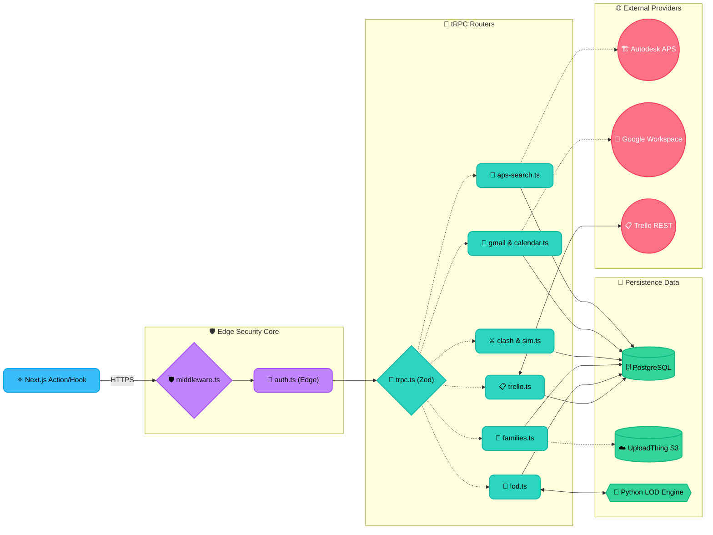

```mermaid
graph LR
    classDef client fill:#38bdf8,stroke:#0ea5e9,stroke-width:2px,color:#000,rx:10,ry:10;
    classDef edge fill:#c084fc,stroke:#a855f7,stroke-width:2px,color:#000,rx:10,ry:10;
    classDef router fill:#2dd4bf,stroke:#14b8a6,stroke-width:2px,color:#000,rx:10,ry:10;
    classDef db fill:#34d399,stroke:#10b981,stroke-width:2px,color:#000;
    classDef ext fill:#fb7185,stroke:#f43f5e,stroke-width:2px,color:#fff;

    Client["⚛️ Next.js Action/Hook"]:::client

    subgraph "🛡️ Edge Security Core"
        MW{"🛡️ middleware.ts"}:::edge
        AUTH["🔑 auth.ts (Edge)"]:::edge
    end

    subgraph "🔗 tRPC Routers"
        TRPC{"🔗 trpc.ts (Zod)"}:::router
        R1["🚢 aps-search.ts"]:::router
        R2["📧 gmail & calendar.ts"]:::router
        R3["⚔️ clash & sim.ts"]:::router
        R4["🌳 families.ts"]:::router
        R5["🤖 lod.ts"]:::router
        R6["📋 trello.ts"]:::router
    end

    subgraph "💾 Persistence Data"
        PG[("🗄️ PostgreSQL")]:::db
        S3[("☁️ UploadThing S3")]:::db
        LODENG{{"🤖 Python LOD Engine"}}:::db
    end

    subgraph "🌐 External Providers"
        APS(("🏗️ Autodesk APS")):::ext
        GL(("📧 Google Workspace")):::ext
        TR(("📋 Trello REST")):::ext
    end

    Client -->|HTTPS| MW
    MW --> AUTH
    AUTH --> TRPC
    
    TRPC -.-> R1
    TRPC -.-> R2
    TRPC -.-> R3
    TRPC -.-> R4
    TRPC -.-> R5
    TRPC -.-> R6

    R1 --> PG
    R1 -.-> APS
    
    R2 -.-> GL
    R2 --> PG
    
    R3 --> PG
    
    R4 --> PG
    R4 -.-> S3
    
    R5 --> PG
    R5 <--> LODENG
    
    R6 --> PG
    R6 <--> TR
```
