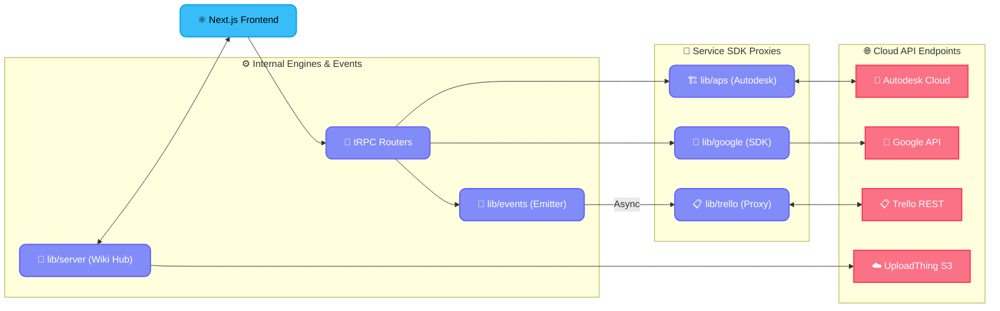

```mermaid
graph LR
    classDef client fill:#38bdf8,stroke:#0ea5e9,stroke-width:2px,color:#000,rx:10,ry:10;
    classDef logic fill:#818cf8,stroke:#6366f1,stroke-width:2px,color:#fff,rx:10,ry:10;
    classDef ext fill:#fb7185,stroke:#f43f5e,stroke-width:2px,color:#fff;

    UI["⚛️ Next.js Frontend"]:::client

    subgraph InternalLogic["⚙️ Internal Engines & Events"]
        EVT["📢 lib/events (Emitter)"]:::logic
        TRPC["🔗 tRPC Routers"]:::logic
        WIKI["📝 lib/server (Wiki Hub)"]:::logic
    end

    subgraph Engines["🔧 Service SDK Proxies"]
        APS["🏗️ lib/aps (Autodesk)"]:::logic
        GOOG["📅 lib/google (SDK)"]:::logic
        TREL["📋 lib/trello (Proxy)"]:::logic
    end

    subgraph Providers["🌐 Cloud API Endpoints"]
        E_APS["🏢 Autodesk Cloud"]:::ext
        E_GOOG["📧 Google API"]:::ext
        E_TREL["📋 Trello REST"]:::ext
        E_S3["☁️ UploadThing S3"]:::ext
    end

    UI --> TRPC
    TRPC --> EVT
    
    %% Trello Flow
    EVT -->|Async| TREL
    TREL <--> E_TREL
    
    %% Google Flow
    TRPC --> GOOG
    GOOG --> E_GOOG
    
    %% Wiki Flow
    WIKI --> E_S3
    WIKI <--> UI
    
    %% APS Flow
    TRPC --> APS
    APS <--> E_APS
```
