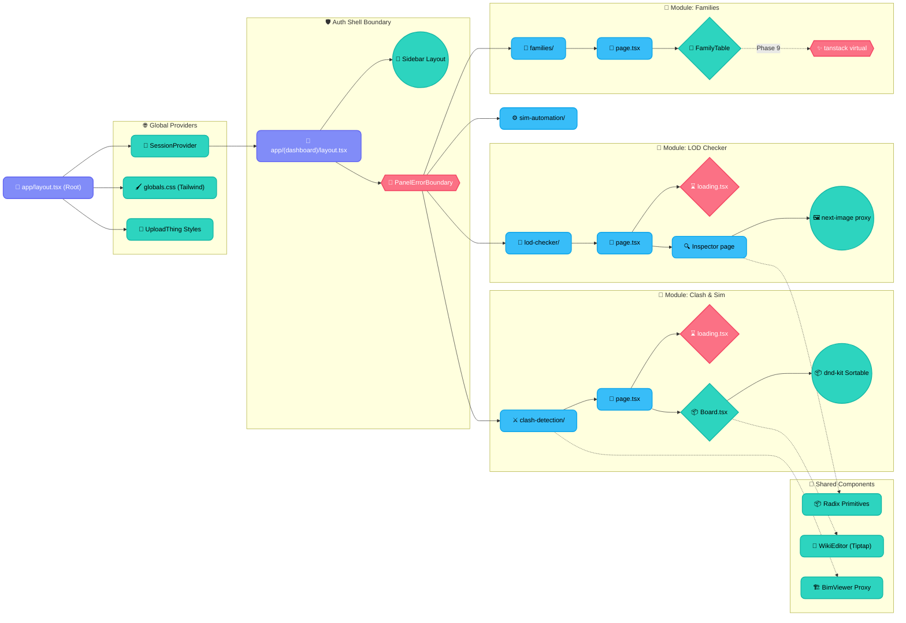

```mermaid
graph LR
    classDef layout fill:#818cf8,stroke:#6366f1,stroke-width:2px,color:#fff,rx:10,ry:10;
    classDef route fill:#38bdf8,stroke:#0ea5e9,stroke-width:2px,color:#000,rx:10,ry:10;
    classDef comp fill:#2dd4bf,stroke:#14b8a6,stroke-width:2px,color:#000,rx:10,ry:10;
    classDef boundary fill:#fb7185,stroke:#f43f5e,stroke-width:2px,color:#fff,rx:10,ry:10;

    R["💎 app/layout.tsx (Root)"]:::layout
    
    subgraph GlobalProviders["🌐 Global Providers"]
        CTX["🔑 SessionProvider"]:::comp
        CSS["🖌️ globals.css (Tailwind)"]:::comp
        UIX["📁 UploadThing Styles"]:::comp
    end

    R --> CTX
    R --> CSS
    R --> UIX
    
    CTX --> DL["🏢 app/(dashboard)/layout.tsx"]:::layout

    subgraph AuthShell["🛡️ Auth Shell Boundary"]
        DL --> SB(("📁 Sidebar Layout")):::comp
        DL --> EB{{"🛑 PanelErrorBoundary"}}:::boundary
    end

    EB --> MOD1["⚔️ clash-detection/"]:::route
    EB --> MOD2["⚙️ sim-automation/"]:::route
    EB --> MOD3["🤖 lod-checker/"]:::route
    EB --> MOD4["🌳 families/"]:::route

    subgraph ModClash["🧩 Module: Clash & Sim"]
        MOD1 --> P1["📄 page.tsx"]:::route
        P1 --> L1{"⌛ loading.tsx"}:::boundary
        P1 --> KB1{"📦 Board.tsx"}:::comp
        KB1 --> DND(("📦 dnd-kit Sortable")):::comp
    end

    subgraph ModLod["🧩 Module: LOD Checker"]
        MOD3 --> P3["📄 page.tsx"]:::route
        P3 --> L3{"⌛ loading.tsx"}:::boundary
        P3 --> ID3["🔍 Inspector page"]:::route
        ID3 --> IMG(("🖼️ next-image proxy")):::comp
    end

    subgraph ModFam["🧩 Module: Families"]
        MOD4 --> P4["📄 page.tsx"]:::route
        P4 --> T4{"🌳 FamilyTable"}:::comp
        T4 -.->|Phase 9| VIRT{{"✨ tanstack virtual"}}:::boundary
    end

    subgraph SharedComps["🎨 Shared Components"]
        SH_SHAD["📦 Radix Primitives"]:::comp
        SH_WIKI["📝 WikiEditor (Tiptap)"]:::comp
        SH_BIM["🏗️ BimViewer Proxy"]:::comp
    end

    KB1 -.-> SH_WIKI
    ID3 -.-> SH_SHAD
    MOD1 -.-> SH_BIM
```
