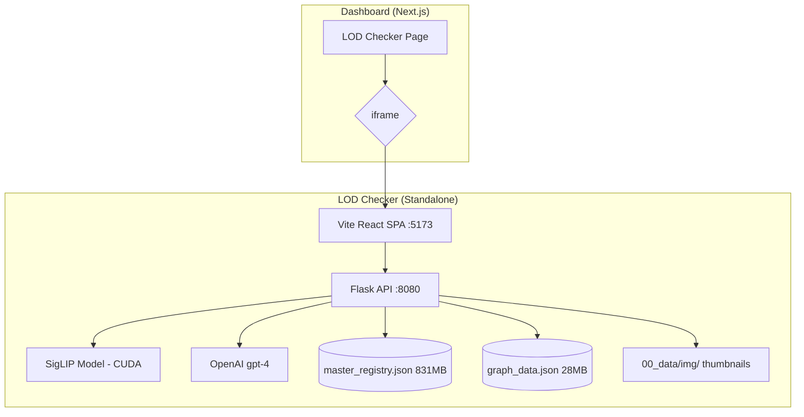

# Diagnostic: LOD Checker Codebase — Full Deep Analysis

> Generated by Antigravity on 2026-04-15

---

## Executive Summary

The LOD Checker is a **standalone BIM family visual search engine** built on a `Flask (Python 3.12) + Vite/React 19` split architecture. It uses **SigLIP** (vision-language model) to compute image embeddings for 3D family thumbnails and enables cosine-similarity search enhanced with **OpenAI query expansion**. All data is stored in **flat JSON files on disk** — no database.

The Dashboard currently embeds the LOD Checker via **an iframe** pointing to `localhost:5173`, which is fragile, requires a separate process, creates auth silos, and cannot be deployed to Railway.

---

## System Topology



---

## Backend Architecture (`run_viz.py` + Flask Blueprints)

### Entry Point: `run_viz.py` (138 lines)

- Loads YAML config from `04_config/config/default.yaml`
- Auto-relaunches with venv Python if CUDA venv exists
- Registers 3 Flask Blueprints: `aps_auth_bp`, `aps_data_bp`, `search_bp`
- Starts Flask on `0.0.0.0:8080` in a daemon thread
- Starts Vite dev server as the foreground blocking process
- Initializes `BackendResources` (heavy ML model loading)

### Blueprint: `aps_auth` (230 lines)

| Route | Method | Purpose |
| --- | --- | --- |
| `/api/auth/login` | GET | Redirect to Autodesk OAuth2 authorize |
| `/api/auth/callback` | GET | Exchange auth code for tokens, fetch profile |
| `/api/auth/profile` | GET | Return session user or `{authenticated: false}` |
| `/api/auth/logout` | GET | Clear Flask session |
| `/api/auth/status` | GET | Diagnostic: token presence, expiry, scopes |

Auth is **session-based** (signed Flask cookie), NOT JWT. Tokens stored in `session["access_token"]`, `session["refresh_token"]`, `session["expires_at"]`.

### Blueprint: `aps_data` (439 lines)

| Route | Method | Purpose |
| --- | --- | --- |
| `/api/aps/hubs` | GET | List APS hubs |
| `/api/aps/accounts` | GET | Diagnostic: HQ account listing |
| `/api/aps/hubs/<id>/projects` | GET | Paginated project listing |
| `/api/aps/hubs/<h>/projects/<p>/top-folders` | GET | Root folder listing |
| `/api/aps/projects/<p>/search-summary` | GET | Deep .rvt file search (paginated, with retry-on-429) |
| `/api/aps/projects/<p>/folders/<f>/contents` | GET | Folder contents listing |
| `/api/aps/thumbnails/<urn>` | GET | Model thumbnail proxy (cached 24h) |
| `/api/aps/token` | GET | Viewer token proxy |

Key Feature: `get_project_search_summary` does **deep recursive search** across all top folders for `.rvt` files with paginated fallback and 429 retry (up to 3 attempts with exponential backoff).

### Blueprint: `search_service` (404 lines)

| Route | Method | Purpose |
| --- | --- | --- |
| `/api/search` | GET | AI-powered similarity search |
| `/vectors/<path>` | GET | Static JSON file serving |
| `/img/<path>` | GET | Image file serving |
| `/img/thumb/<path>` | GET | Thumbnail serving |
| `/api/analyze_batch` | POST | OpenAI batch analysis |
| `/api/run/pipeline/status` | GET | Pipeline status polling |
| `/api/run/local_pipeline` | POST | Upload + run ML pipeline |
| `/api/delete/image` | DELETE | Delete image + rebuild graphs |

### `BackendResources` Class

The central resource holder:

- Loads `master_registry.json` (831 MB!) into memory
- Validates records via Pydantic schemas
- Extracts `image_embedding` vectors → normalized numpy matrix
- Loads **SigLIP** model onto CUDA/CPU
- Maintains an in-memory `query_cache` for OpenAI expansions

### Search Algorithm (`search()`)

```
1. User query → OpenAI expansion (cached)
2. Both queries → SigLIP text encoder → 2 embedding vectors
3. Weighted average: 0.3 × original + 0.7 × expanded
4. L2 normalize → cosine similarity against all registry embeddings
5. Keyword boost: +0.15 per matching term in metadata fields
6. Top-200 results returned
```

---

## Data Layer

### `master_registry.json` — 831 MB (!)

A flat JSON array where each record contains:

```json
{
  "id": "unique-hash",
  "name_of_file": "door_01.png",
  "final_category": "Doors",
  "family_name": "Single Panel Door",
  "provider": "Revit 2024",
  "image_embedding": [0.0123, -0.0456, ...],  // 768-dim SigLIP vector
  "lod_label": "LOD 300",
  "full_description": "...",
  "confidence_level": "high",
  "possible_categories": ["Doors", "Openings"],
  "file_size_kb": 245
}
```

### `graph_data.json` — 28 MB

UMAP-projected 2D layout with KNN neighbor graph:

```json
{
  "meta": { "count": N, "umap": {...}, "knn": {...}, "bounds": {...} },
  "nodes": [
    {
      "idx": 0, "id": "unique-hash",
      "x": 1.234, "y": -5.678,
      "neighbors": [1, 5, 23],
      "img": "/img/door_01.png",
      "name": "door_01.png",
      "final_category": "Doors",
      "lod_label": "LOD 300"
    }
  ]
}
```

### `Categories.json` — 76 KB

136-category BIM taxonomy with subcategories and descriptions (the "golden" reference).

---

## Frontend Architecture (Vite + React 19)

### Tech Stack

| Package | Version | Purpose |
| --- | --- | --- |
| `react` | ^19.2.0 | UI |
| `framer-motion` | ^12.34.3 | Animations |
| `lucide-react` | ^0.563.0 | Icons |
| `recharts` | ^3.7.0 | Charts/Analytics |
| `tailwindcss` | ^3.4.19 | Styling (**v3, not v4**) |
| `vite` | ^7.3.1 | Build tool |

### Page Flow

```
LandingPage → (search) → MinimalLoading → GraphPage → (select URN) → ApsViewer
```

### Component Tree

```
App.tsx
├── LandingPage       — Search input + categories grid + ACC browser
├── GraphPage         — Canvas-based graph visualization
│   ├── GraphCanvas   — WebGL/Canvas 2D similarity graph
│   ├── DetailPanel   — Selected node metadata + image
│   ├── SearchBar     — In-graph search
│   └── LayoutTabs    — similarity/category/lod/provider modes
├── ApsViewer         — Autodesk Viewer SDK integration
└── UserProfile       — Autodesk auth badge
```

### Hooks

| Hook | Purpose |
| --- | --- |
| `useGraphData` | Fetches and manages `graph_data.json` state |
| `useAISearch` | Manages search query → results lifecycle |
| `useAccData` | APS hub/project/folder navigation |
| `useAuth` | Autodesk session management |
| `useAnalysis` | OpenAI batch analysis |
| `usePipelineUpload` | File upload → pipeline execution |
| `useProgressEngine` | Pipeline progress polling |
| `useNodeDeletion` | Graph node removal lifecycle |
| `useKeyboard` | Keyboard shortcut binding |

---

## Current Dashboard Integration

The Dashboard's `lod-checker/page.tsx` is a **thin iframe wrapper** (80 lines):

```tsx
<iframe
  src="http://localhost:5173"
  sandbox="allow-scripts allow-same-origin allow-forms allow-popups allow-downloads"
  onLoad={handleLoad}
  onError={handleError}
/>
```

### Problems with iframe approach:
1. **Dual process requirement** — Must run Flask + Vite separately
2. **Auth silo** — LOD Checker has its own Autodesk OAuth (separate from Dashboard's)
3. **No database integration** — Data lives in flat JSON files
4. **Not deployable** — Can't ship a Python Flask server + CUDA to Railway
5. **CORS/cookie isolation** — Cross-origin restrictions
6. **No shared state** — User identity, project context not shared
7. **Performance** — 831 MB JSON loaded into Python memory on startup
8. **No caching** — Every restart re-parses 831 MB JSON

---

## Key Metrics

| Metric | Value |
| --- | --- |
| **Backend** | Python 3.12 + Flask |
| **Frontend** | Vite 7 + React 19 + Tailwind v3 |
| **Data Size** | 831 MB (registry) + 28 MB (graph) + ~2 GB (images) |
| **Records** | Estimated ~5,000-10,000 BIM family records |
| **Embedding Dim** | 768 (SigLIP base) |
| **Search Method** | Cosine similarity + keyword boost + OpenAI expansion |
| **Auth** | Flask session cookies (APS 3-legged OAuth) |
| **ML Models** | SigLIP, BLIP2, RMBG, GroundingDINO, SAM |
| **Pipeline** | 6-stage: upscale → bg-remove → caption → refine → embed → finalize |
