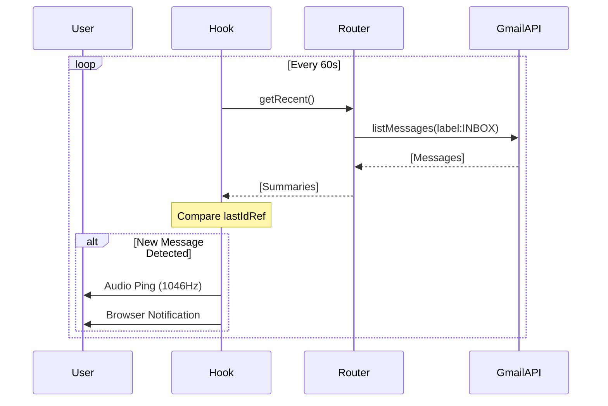

# Implementation Plan - Integrated Gmail Service

> Auto-generated by Antigravity on 2026-04-16
> Goal: Persistent floating mail client with real-time sync.

## Overview

This plan details the implementation of a sidebar-based mail service designed to mirror the existing Google Chat infrastructure while providing independent mail workflows.

## System Schematic

---

## Component Breakdown

### 1. Data Service Layer (`lib/email.ts`)
- **Retrieval Engine**: Integration of `gmail.users.messages.list` and `get`.
- **MIME Parsing**: Multi-part body resolution (HTML priority).

### 2. UI Subsystem (`components/dashboard/*`)
- **MailPanel**: View state machine (Inbox -> Detail -> Compose).
- **MailService**: Floating entry point with mirroring logic for the Chat FAB.
- **MailPanelProvider**: Dedicated context for visibility and navigation state.

---

## Data Flow

1.  **Hydration**: On mount, `useMailNotifications` triggers the first tRPC `getRecent` call.
2.  **Notification**: Background polling checks for unread bits and ID changes.
3.  **Interaction**: User clicks FAB -> `setOpen(true)` -> Panel slides from left (`translate-x`).
4.  **Composition**: `ComposeView` handles `send.mutate` via tRPC -> `invalidate` queries.

---

## Integration Points

| Ref | Target | Purpose | Pattern |
| --- | --- | --- | --- |
| **M1** | Gmail REST API | Mail sync | tRPC Query (Polled) |
| **M2** | Web Audio API | UX Feedback | Oscillator Synth |

## Conventions

- **Z-Index Strategy**: Panel at `z-[70]`, Overlay at `z-[60]`, FAB at `z-50`.
- **Animation**: 500ms cubic-bezier transition (`transform`).
