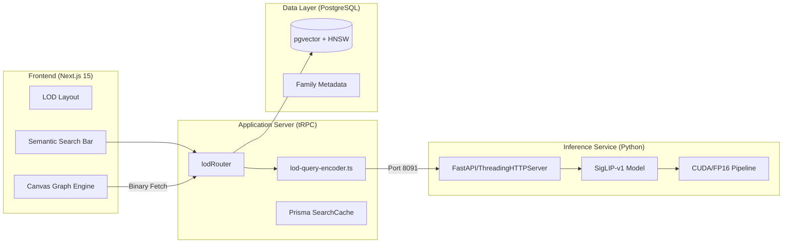

# LOD Checker Stack Mapping

> Auto-generated by Antigravity on 2026-04-16
> Scope: High-Performance Revit Family Registry & Semantic Search Subsystem.

## 1. System Schematic (Orchestration)

The LOD Checker is a dual-language subsystem bridging high-level web orchestration (Node.js) with deep learning inference (Python).

---

## 2. Technology Inventory

### 2a. Backend Orchestration (Node.js)

| Technology | Role | Details |
| :--- | :--- | :--- |
| **Next.js 15** | Framework | App Router, Server Actions, SSE Events. |
| **tRPC 11** | API | 10+ procedures specifically for LOD lifecycle. |
| **Prisma 5.22** | ORM | Managing family metadata and graph nodes. |
| **OpenAI SDK** | NLP | Semantic query expansion (GPT-4o). |
| **P-Limit** | Concurrency | Managing batch upload/processing rate-limiting. |

### 2b. Inference Engine (Python ML)

| Library | Version | Purpose |
| :--- | :--- | :--- |
| **PyTorch** | 2.x | Core tensor compute & CUDA management. |
| **Transformers** | Latest | HuggingFace SigLIP model integration. |
| **Torch.cuda** | 12.x | Active GPU affinity for RTX hardware. |
| **FastAPI** | (Target) | High-concurrency async inference wrapper. |

### 2c. Data Layer (PostgreSQL)

| Feature | Level | Purpose |
| :--- | :--- | :--- |
| **pgvector** | v0.5+ | Storage of 768-dimensional float embeddings. |
| **HNSW Index** | Active | O(log n) proximity search for 24k+ families. |
| **JSONB** | Native | Flexible categorization schema storage. |

---

## 3. Data Flow (Inference Pipeline)

### Search Flow (Latency: ~1.2s)
1. **Input**: User types "Pipe fitting with insulation".
2. **Parallel Step**: 
   - **Expansion**: tRPC hits OpenAI to expand query to technical Revit terms.
   - **Base Embed**: tRPC hits Python Service for base query vector.
3. **Blending**: Result vectors are blended (0.7 expanded / 0.3 base).
4. **Vector Search**: PostgreSQL executes cosine distance search via HNSW.
5. **Hydration**: Family metadata is joined and returned to UI.

### Visualization Logic
- **Canvas Engine**: Renders 24,000+ nodes using a viewport-aware culling algorithm.
- **Normalization**: Graph coordinates (x,y) are normalized to [0,1] for cross-device consistency.
- **Optimistic UI**: Search results are highlighted on the graph using local state before server confirmation.

---

## 4. Entity Relationship (LOD Registry)

- `LodFamily`: Central registry of Revit models (Name, Size, Category).
- `LodEmbedding`: Specialized vector store linked 1:1 with families.
- `LodGraphNode`: Spatial coordinates for the "World of Families" cluster map.
- `LodSearchCache`: Time-limited caching of expansive query results.

---

## 5. Hardware Profile

| Specification | Requirement | Optimization Status |
| :--- | :--- | :--- |
| **GPU Vendor** | NVIDIA | **Active** (via `torch.cuda`) |
| **Architecture** | Turing/Ampere+ | **Optimized** (via Tensor Cores) |
| **Precision** | FP16 Half | **Active** (2x throughput, 50% VRAM) |
| **VRAM** | 4GB Minimum | **Targeted** (~1.2GB active footprint) |

---

## 6. Technical Debt Registry

- [ ] **Binary Streaming**: Graph data (24k nodes) is currently JSON-over-HTTP; high deserialization cost.
- [ ] **Redis Caching**: Search results are in Postgres; 50ms latency penalty vs Redis.
- [ ] **Python Async**: Current server uses `ThreadingHTTPServer`; migrating to `FastAPI` for async VRAM concurrency.
