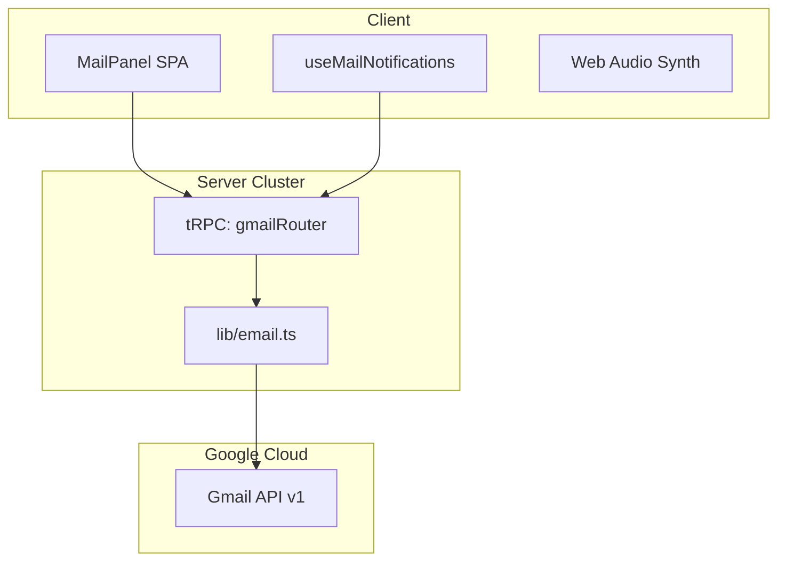

# Technical Debt - Integrated Gmail Service

> Auto-generated by Antigravity on 2026-04-16
> Status: Phase 1 Executed, debt pass updated 2026-04-16

## Overview

The Gmail Service provides an in-dashboard mail client mirroring the Google Chat "Floating Service" pattern. It enables read/write access to the shared organizational inbox with real-time audio notifications.

## System Topology

---

## Technical Debt Inventory

## Resolution Snapshot

- **Resolved**: Mail notification audio now uses the shared `lib/sound-engine.ts` path used by Chat, removing the duplicated Web Audio context and ping queue logic.
- **Resolved**: `use-mail-notifications.ts` now uses adaptive polling (`15s` foreground / `60s` background) plus window-focus refetch, reducing the original one-minute notification lag.
- **Mitigated**: `lib/email.ts` now reuses `buildGoogleDriveOAuthClient()`, and the shared Google service auth helper caches the Drive/Gmail OAuth client instead of rebuilding it on every mail code path.
- **Resolved**: Mail sending now goes through a centralized multipart MIME builder with UTF-8 header encoding and plain-text fallback instead of the earlier ad hoc raw line join.
- **Resolved**: Attachments are now exposed through `/api/gmail/attachment` and rendered inside `MailPanel`, including inline previews for images and PDFs.
- **Open**: Team-inbox auth scope remains shared through `GMAIL_USER`; personal Gmail linking and per-user inbox isolation are still not implemented.
- **Open**: Push delivery still depends on polling; Google Pub/Sub + webhook delivery is not implemented yet.

### 5a. Code Smells

| Smell | Location | Impact | Risk |
| --- | --- | --- | --- |
| **Polling Latency** | `use-mail-notifications.ts` | Adaptive polling now reduces latency while the app is visible. | **Low** - Still polling-based until push delivery exists. |
| **Shared Auth Scope** | `lib/email.ts` | Uses shared `GMAIL_USER` refresh token for all users. | **High** - No support for individual private inboxes yet. |
| **Manual MIME Build** | `lib/email.ts` | Centralized multipart MIME generation with encoded headers replaces the earlier inline array-join builder. | **Low** - Attachments in outbound compose are still not supported. |

### 5b. Pattern Inconsistencies

- **Notification Unification**: Resolved via shared `lib/sound-engine.ts`.
- **Provider Redundancy**: Mitigated for the shared Gmail/Drive service-auth path by reusing `buildGoogleDriveOAuthClient()`. User-linked Chat OAuth remains a separate flow by design.

### 5c. Missing Elements

- [ ] **Push Notifications**: Missing Google Pub/Sub + Webhook integration for sub-second mail arrival alerts.
- [ ] **OAuth Personalization**: No UI path for users to link their *own* Gmail accounts (locked to team account).
- [x] **Attachment Proxy**: `MailPanel` now renders proxied Gmail attachments, with inline previews for images and PDFs.

---

## Integration Points

| Service | Type | Purpose | Auth Cascade |
| --- | --- | --- | --- |
| **Gmail API** | REST | Inbox/Send | `GMAIL_OAUTH_CLIENT_ID` (env) |
| **Web Audio** | Client | Notify | AudioContext (Primed) |

## Documentation Integrity

**Naming:** Routers follow the `gmailRouter` naming convention in `server/routers/gmail.ts`.
**Structure:** Hook lifecycle is tied to the `MailPanelProvider` context.
**Testing:** Verified via manual "Send to Self" integration test.
