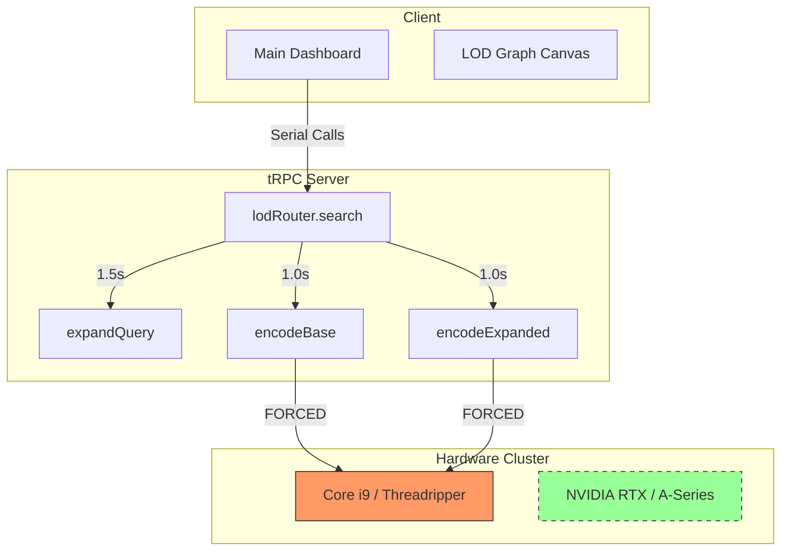

# Technical Debt - General Speed & Bottlenecks

> Auto-generated by Antigravity on 2026-04-16
> Goal: Identify and document all latency sinks and hardware misalignment.

## Overview

The LECG Dashboard currently exhibits several architectural "speed traps" that degrade the high-performance real-time experience. Most significantly, the **LOD Checker inference engine is artificially throttled to CPU** despite high-end hardware availability.

## System Schematic (Bottleneck Mapping)

---

## Technical Debt Inventory

### 5a. Critical Bottlenecks (LOD Checker)

| Module | Debt Item | Impact | Root Cause |
| :--- | :--- | :--- | :--- |
| **LOD Encoder** | **Locked CPU Device** | **High** (3x Latency) | `.env` file explicitly sets `LOD_QUERY_ENCODER_DEVICE=cpu`. |
| **Search Sync** | **Sequential Pipeline** | **High** (~2s Overhead) | `search` router awaits OpenAI, then Embed 1, then Embed 2 in series. |
| **GPU Inference** | **Global Lock** | **Medium** | Python's `threading.Lock` prevents truly parallel GPU batching. |
| **pgvector** | **Index Maturity** | **Medium** | Standard `IVFFlat` usage; lacks `HNSW` (Hierarchical Navigable Small World) for sub-ms search. |

### 5b. Code Smells (General Speed)

- **Layout Pre-fetch Overload**: `app/(dashboard)/layout.tsx` prefetches 17+ different data segments on every page visit, regardless of visibility.
- **Shadow Vectoring**: `LodEmbedding` utilizes raw SQL (`$executeRawUnsafe`) for `pgvector` interactions, bypassing Prisma's type safety and migration tracking. This leads to "Shadow Debt" where indices are not maintained via migrations.
- **JSON Bloat**: The `getGraphData` procedure returns 24,000+ nodes in a single JSON payload. This causes significant browser-side main thread locking during deserialization.

### 5c. Missing Speed Features

- [ ] **Redis/In-Memory Cache**: Currently using a database table (`LodSearchCache`) for search results; latency is 50-100ms higher than Redis.
- [ ] **CUDA Tensor Cores**: `SiglipModel` is not utilizing FP16 mixed precision or TensorRT for optimized silicon utilization.
- [ ] **Binary Graph API**: Lack of Protobuf/FlatBuffers for the 24k node LOD graph transfer.

---

## Integration Bottlenecks

| Service | Protocol | Latency | Bottleneck |
| :--- | :--- | :--- | :--- |
| **OpenAI** | REST | 1500ms+ | Per-request token generation overhead. |
| **Prisma** | DB | 50-200ms | Connection pooling saturation during batch analysis. |
| **LOD Encoder** | HTTP | 1000ms | Serialization overhead between Node.js and Python. |

## Conventions

- **Performance Logging**: Currently logs only success/failure, lacks "Time-to-First-Result" telemetry.
- **Hardware Fallback**: SILENT fallback to CPU occurs if CUDA is unavailable; users are not warned of degraded performance.
