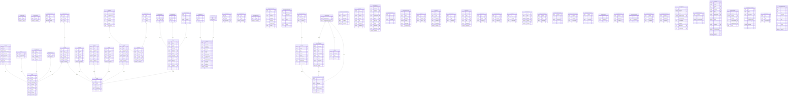

```mermaid
erDiagram

  "User" {
    String id "🗝️"
    String name "❓"
    String email 
    String username "❓"
    DateTime emailVerified "❓"
    String password "❓"
    String image "❓"
    String department "❓"
    String jobTitle "❓"
    String role 
    DateTime createdAt 
    DateTime lastLoginAt "❓"
    }
  

  "Account" {
    String id "🗝️"
    String type 
    String provider 
    String providerAccountId 
    String refresh_token "❓"
    String access_token "❓"
    Int expires_at "❓"
    String token_type "❓"
    String scope "❓"
    String id_token "❓"
    String session_state "❓"
    }
  

  "Session" {
    String id "🗝️"
    String sessionToken 
    DateTime expires 
    }
  

  "VerificationToken" {
    String identifier 
    String token 
    DateTime expires 
    }
  

  "ApprovedEmail" {
    String id "🗝️"
    String email 
    DateTime createdAt 
    }
  

  "PendingRequest" {
    String id "🗝️"
    String email 
    String name "❓"
    String provider 
    DateTime requestedAt 
    String status 
    }
  

  "UserModuleAccess" {
    String id "🗝️"
    String module 
    }
  

  "PasswordResetToken" {
    String id "🗝️"
    String email 
    String token 
    DateTime expires 
    DateTime createdAt 
    }
  

  "Project" {
    String id "🗝️"
    String name 
    String client "❓"
    DateTime createdAt 
    DateTime updatedAt 
    String apsProjectId "❓"
    String apsHubId "❓"
    }
  

  "Family" {
    String id "🗝️"
    String name 
    String category 
    String phase 
    Int phaseOrder 
    String description "❓"
    String nextSteps "❓"
    DateTime dueDate "❓"
    DateTime requestDate "❓"
    DateTime completionDate "❓"
    String owner "❓"
    Boolean isBlocked 
    String blockedBy "❓"
    String apsUrn "❓"
    String apsStatus "❓"
    DateTime createdAt 
    DateTime updatedAt 
    }
  

  "FamilyChangelog" {
    String id "🗝️"
    String version 
    String author 
    String message 
    String impact "❓"
    DateTime createdAt 
    }
  

  "FamilyAttachment" {
    String id "🗝️"
    String type 
    String url 
    String name 
    }
  

  "FamilyDeliverable" {
    String id "🗝️"
    String name 
    String fileUrl "❓"
    Boolean done 
    }
  

  "ClashWiki" {
    String id "🗝️"
    String section 
    String title 
    String content 
    Bytes yjsState "❓"
    String status 
    Int order 
    DateTime updatedAt 
    }
  

  "ClashTask" {
    String id "🗝️"
    String title 
    String description "❓"
    String status 
    String milestone "❓"
    DateTime dueDate "❓"
    String owner "❓"
    Int order 
    Boolean isBlocked 
    DateTime createdAt 
    DateTime updatedAt 
    }
  

  "SimWiki" {
    String id "🗝️"
    String section 
    String title 
    String content 
    Bytes yjsState "❓"
    String status 
    Int order 
    DateTime updatedAt 
    }
  

  "SimTask" {
    String id "🗝️"
    String title 
    String description "❓"
    String status 
    String milestone "❓"
    DateTime dueDate "❓"
    String owner "❓"
    Int order 
    Boolean isBlocked 
    DateTime createdAt 
    DateTime updatedAt 
    }
  

  "RevitExam" {
    String id "🗝️"
    String title 
    String description "❓"
    String status 
    String formUrl "❓"
    String formId "❓"
    DateTime dueDate "❓"
    DateTime createdAt 
    }
  

  "ExamBuildTask" {
    String id "🗝️"
    String title 
    String status 
    Int order 
    DateTime dueDate "❓"
    }
  

  "ExamResult" {
    String id "🗝️"
    String candidateName 
    String candidateEmail "❓"
    Float score 
    Float maxScore 
    Int attempts 
    DateTime completedAt 
    String notes "❓"
    String failureTopics "❓"
    }
  

  "UserTask" {
    String id "🗝️"
    String title 
    String description "❓"
    String status 
    String priority 
    DateTime dueDate "❓"
    DateTime createdAt 
    DateTime updatedAt 
    }
  

  "TaskAttachment" {
    String id "🗝️"
    String url 
    String name 
    String type 
    DateTime createdAt 
    }
  

  "LodFamily" {
    String id "🗝️"
    String nameOfFile 
    String familyName "❓"
    String finalCategory "❓"
    String lodLabel "❓"
    String provider "❓"
    String caption "❓"
    String fullDescription "❓"
    String confidenceLevel "❓"
    Float fileSizeKb "❓"
    String possibleCategories 
    String originalFile "❓"
    String imagePath "❓"
    String thumbPath "❓"
    DateTime createdAt 
    DateTime updatedAt 
    }
  

  "LodEmbedding" {
    String id "🗝️"
    Float vector 
    }
  

  "LodGraphNode" {
    String id "🗝️"
    Float x 
    Float y 
    Int neighbors 
    }
  

  "LodCategory" {
    String id "🗝️"
    String name 
    String group "❓"
    String description "❓"
    Json subcategories "❓"
    }
  

  "AccMemberCache" {
    String id "🗝️"
    String email 
    Json data 
    DateTime syncedAt 
    DateTime createdAt 
    }
  

  "AccHubRoleCache" {
    String id "🗝️"
    Json roles 
    DateTime syncedAt 
    }
  

  "AccGraphLayoutCache" {
    String id "🗝️"
    Json nodes 
    Json edges 
    Float positions 
    String dataHash 
    Int nodeCount 
    Int edgeCount 
    Int instanceCount 
    Int projectCount 
    String nodeIds 
    DateTime updatedAt 
    }
  

  "AccPersonGraphSnapshot" {
    Int k "🗝️"
    String dataHash 
    Int personCount 
    Int edgeCount 
    Int dim 
    Json nodes 
    Json nodes3d 
    Json edges 
    Json clusters 
    DateTime builtAt 
    }
  

  "AccProject" {
    String id "🗝️"
    String accountId 
    String name 
    String jobNumber "❓"
    String type "❓"
    String status 
    String folderCrawlStatus 
    DateTime createdAt "❓"
    DateTime updatedAt 
    }
  

  "AccProjectMember" {
    String id "🗝️"
    String autodeskId 
    String email 
    String name 
    String status 
    String companyName "❓"
    String phone "❓"
    DateTime addedOn "❓"
    DateTime lastSignIn "❓"
    Boolean projectAdmin 
    Boolean executive 
    Json products 
    DateTime syncedAt 
    }
  

  "AccRole" {
    String id "🗝️"
    String accountId 
    String name 
    Int memberCount 
    DateTime syncedAt 
    }
  

  "AccProjectRole" {
    String id "🗝️"
    String docsAccessLevel "❓"
    String projectAdminAccessLevel "❓"
    }
  

  "AccFolder" {
    String id "🗝️"
    String parentId "❓"
    String name 
    String fullPath "❓"
    DateTime syncedAt 
    Int fileCount "❓"
    Float totalSizeBytes "❓"
    DateTime lastModifiedTime "❓"
    String lastModifiedBy "❓"
    String latestVersionAddedBy "❓"
    Int maxVersionNumber "❓"
    }
  

  "AccFolderPermission" {
    String id "🗝️"
    String roleId 
    String actions 
    String permType 
    DateTime syncedAt 
    }
  

  "AccFolderPermissionSummary" {
    String id "🗝️"
    String projectId 
    String roleId 
    Int folderCount 
    BigInt totalBytes 
    String permTypes 
    DateTime refreshedAt 
    }
  

  "AccActivity" {
    String id "🗝️"
    String autodeskId 
    String userEmail "❓"
    String projectId "❓"
    String rawAction 
    String service "❓"
    String tool "❓"
    String details "❓"
    String sourceFile 
    String ingestRunId "❓"
    DateTime createdAt 
    }
  

  "AccActivityAccds" {
    String accdsActivityId "🗝️"
    String autodeskId 
    String userEmail "❓"
    String userName "❓"
    String projectId 
    String serviceGroup "❓"
    String activityVerb 
    String objectId "❓"
    String objectType "❓"
    String objectName "❓"
    String folderId "❓"
    String folderName "❓"
    DateTime createdAt 
    String ingestRunId "❓"
    DateTime fetchedAt 
    }
  

  "UnresolvedAttribution" {
    String id "🗝️"
    String activityId 
    String rawEmail "❓"
    String rawDetails "❓"
    String reason 
    DateTime createdAt 
    }
  

  "AccDataConnectorJob" {
    String id "🗝️"
    String requestId 
    String status 
    String serviceGroups 
    String dateRange "❓"
    DateTime startedAt 
    DateTime completedAt "❓"
    String downloadUrl "❓"
    String errorMessage "❓"
    }
  

  "SyncMeta" {
    String id "🗝️"
    DateTime lastRunAt "❓"
    String lastStatus "❓"
    String lastError "❓"
    DateTime updatedAt 
    }
  

  "AccDcUser" {
    String id "🗝️"
    String email "❓"
    String name "❓"
    String status "❓"
    String companyId "❓"
    String autodeskId "❓"
    DateTime lastSignIn "❓"
    String ingestRunId 
    DateTime ingestedAt 
    }
  

  "AccDcCompany" {
    String id "🗝️"
    String name 
    String hubId "❓"
    String ingestRunId 
    DateTime ingestedAt 
    }
  

  "AccDcProject" {
    String id "🗝️"
    String accountId 
    String name 
    String jobNumber "❓"
    String status "❓"
    String type "❓"
    DateTime createdAt "❓"
    String ingestRunId 
    DateTime ingestedAt 
    }
  

  "AccDcAccount" {
    String id "🗝️"
    String name 
    String region "❓"
    String ingestRunId 
    DateTime ingestedAt 
    }
  

  "AccDcBusinessUnit" {
    String id "🗝️"
    String name 
    String accountId "❓"
    String ingestRunId 
    DateTime ingestedAt 
    }
  

  "AccDcRole" {
    String id "🗝️"
    String name 
    String accountId "❓"
    String ingestRunId 
    DateTime ingestedAt 
    }
  

  "AccDcProjectUser" {
    String projectId "🗝️"
    String userId "🗝️"
    String status "❓"
    DateTime addedOn "❓"
    DateTime lastSignIn "❓"
    String ingestRunId 
    DateTime ingestedAt 
    }
  

  "AccDcProjectUserRole" {
    String projectId "🗝️"
    String userId "🗝️"
    String roleId "🗝️"
    String ingestRunId 
    DateTime ingestedAt 
    }
  

  "AccDcProjectUserProduct" {
    String projectId "🗝️"
    String userId "🗝️"
    String productKey "🗝️"
    String accessLevel 
    String ingestRunId 
    DateTime ingestedAt 
    }
  

  "AccDcProjectUserCompany" {
    String projectId "🗝️"
    String userId "🗝️"
    String companyId "🗝️"
    String ingestRunId 
    DateTime ingestedAt 
    }
  

  "AccDcProjectUserService" {
    String projectId "🗝️"
    String userId "🗝️"
    String serviceKey "🗝️"
    String accessLevel 
    String ingestRunId 
    DateTime ingestedAt 
    }
  

  "AccDcProjectRole" {
    String projectId "🗝️"
    String roleId "🗝️"
    String ingestRunId 
    DateTime ingestedAt 
    }
  

  "AccDcProjectProduct" {
    String projectId "🗝️"
    String productKey "🗝️"
    String accessLevel 
    String ingestRunId 
    DateTime ingestedAt 
    }
  

  "AccDcProjectCompany" {
    String projectId "🗝️"
    String companyId "🗝️"
    String ingestRunId 
    DateTime ingestedAt 
    }
  

  "AccDcProjectService" {
    String projectId "🗝️"
    String serviceKey "🗝️"
    String accessLevel 
    String ingestRunId 
    DateTime ingestedAt 
    }
  

  "AccDcAccountService" {
    String accountId "🗝️"
    String serviceKey "🗝️"
    String accessLevel 
    String ingestRunId 
    DateTime ingestedAt 
    }
  

  "AccDcIngestRun" {
    String id "🗝️"
    DateTime startedAt 
    DateTime endedAt "❓"
    String status 
    DateTime sliceWindowStart "❓"
    DateTime sliceWindowEnd "❓"
    Int projectsProcessed 
    Json rowsByModule 
    Json rowsByAdminCsv 
    Int quotaUsed 
    Json diffSummary "❓"
    String unknownModulesSeen 
    String errorMessage "❓"
    }
  

  "AccDcBackfillProgress" {
    String projectId "🗝️"
    DateTime earliestCovered "❓"
    DateTime latestCovered "❓"
    DateTime projectCreatedAt 
    Boolean newProjectFlag 
    DateTime updatedAt 
    }
  

  "AccIssue" {
    String id "🗝️"
    String projectId 
    Int displayId "❓"
    String title 
    String description "❓"
    String status "❓"
    String issueTypeId "❓"
    String issueSubtypeId "❓"
    String createdBy "❓"
    DateTime createdAt "❓"
    Boolean deleted 
    Boolean isCoordination 
    String coordinationSource "❓"
    String confidence "❓"
    String clashId "❓"
    Boolean clashValidated 
    Boolean projectMcEnabled 
    Json rawJson "❓"
    String fetchRunId "❓"
    DateTime fetchedAt 
    }
  

  "AccIssueFetchRun" {
    String id "🗝️"
    DateTime startedAt 
    DateTime finishedAt "❓"
    Int projectsTotal "❓"
    Int projectsOk "❓"
    Int projectsForbidden "❓"
    Int issuesUpserted "❓"
    Int coordinationCount "❓"
    String status 
    }
  

  "AccIssueProjectFetchResult" {
    String id "🗝️"
    String runId 
    String projectId 
    String projectName "❓"
    String status 
    Int issueCount 
    Int coordinationCount 
    String errorMessage "❓"
    DateTime startedAt 
    DateTime finishedAt 
    DateTime createdAt 
    DateTime updatedAt 
    }
  

  "AccIssueType" {
    String id "🗝️"
    String name 
    String kind 
    String parentTypeId "❓"
    DateTime updatedAt 
    }
  

  "AccActivityEmbedding" {
    String id "🗝️"
    Float x 
    Float y 
    Int verbId 
    Int objectTypeId 
    Int moduleId 
    Int monthId 
    Int roleId 
    Int companyId 
    Int projectId 
    Int authorId 
    Int folderId 
    String embeddingRunId 
    DateTime updatedAt 
    }
  
    "Account" }o--|| "User" : "user"
    "Session" }o--|| "User" : "user"
    "PendingRequest" |o--|o "User" : "user"
    "UserModuleAccess" }o--|| "User" : "user"
    "Family" }o--|| "Project" : "project"
    "FamilyChangelog" }o--|| "Family" : "family"
    "FamilyAttachment" }o--|| "Family" : "family"
    "FamilyDeliverable" }o--|| "Family" : "family"
    "ClashWiki" }o--|| "Project" : "project"
    "ClashTask" }o--|| "Project" : "project"
    "SimWiki" }o--|| "Project" : "project"
    "SimTask" }o--|| "Project" : "project"
    "ExamBuildTask" }o--|| "RevitExam" : "exam"
    "ExamResult" }o--|| "RevitExam" : "exam"
    "UserTask" }o--|| "Project" : "project"
    "UserTask" }o--|| "User" : "user"
    "TaskAttachment" }o--|| "UserTask" : "task"
    "LodEmbedding" |o--|| "LodFamily" : "family"
    "LodGraphNode" |o--|| "LodFamily" : "family"
    "AccProjectMember" }o--|| "AccProject" : "project"
    "AccProjectRole" }o--|| "AccProject" : "project"
    "AccProjectRole" }o--|| "AccRole" : "role"
    "AccProjectRole" }o--|o "AccProjectMember" : "member"
    "AccFolder" }o--|| "AccProject" : "project"
    "AccFolderPermission" }o--|| "AccFolder" : "folder"
```
