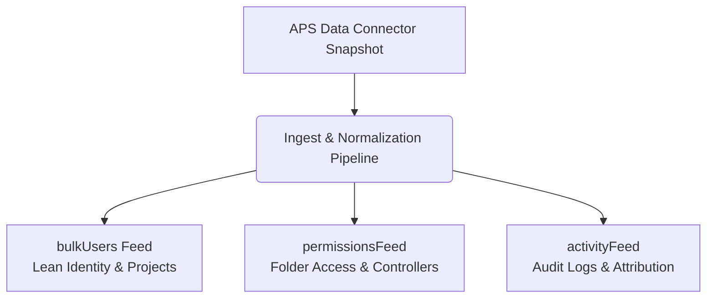

# Autodesk Construction Cloud (ACC) Governance Baseline Report
## Document Metadata & Security Verification Baseline · Version 1.0

This baseline report presents the structural and security audit of the data ingested from the **Autodesk Construction Cloud (ACC)** and **Autodesk Developer Network (APS)** Data Connector. It establishes an empirical baseline for corporate governance, access control, identity compliance, and operational analytics.

---

### Audit Metadata
* **Report Date**: May 20, 2026
* **Database Environment**: PostgreSQL Governance Analytics Database
* **Connector Sources**: ACC Activity API / APS Data Connector snapshots
* **Extraction Period**: Historical archive through May 20, 2026
* **Verification Method**: Direct SQL verification via `scripts/scratch/query-actions.cjs` and strict CLI taxonomy audit
* **Report Classification**: Technical Governance / Security Baseline

---

> [!IMPORTANT]
> **Key Governance Baseline**: LECG now maintains a queryable governance layer over ACC users, companies, roles, activity logs, and folder-level permission records. This baseline enables the dashboard to operate not only as a visualization tool, but as a governance, access-control, and operational analytics system.

---

## 1. Verified Data Inventory

The ingestion pipeline exhibits high data completeness and structural integrity. A comprehensive schema-wide row audit shows the following distributions:

### A. Core Database Table Row Counts
The verified inventory of all operational tables within the LECG governance schema is structured as follows:

| Target Table | Functional Classification | Record Count |
| :--- | :--- | :---: |
| `AccFolderPermission` | Folder-level access rights and permissions | **986,697** |
| `AccDcProjectRole` | APS project-role association cache | **66,340** |
| `AccFolder` | ACC Document Management folder hierarchy tree | **63,437** |
| `AccDcProjectUserProduct` | Assigned APS cloud services/products per user | **40,169** |
| `AccProjectRole` | Project-specific roles | **21,624** |
| `AccDcProjectUser` | APS-extracted project memberships | **16,934** |
| `AccActivity` | Historical audit logs of document, issue, and model actions | **15,571** |
| `AccDcProjectUserRole` | APS user-role mapping join table | **13,711** |
| `AccDcProjectUserCompany` | APS user-company mapping join table | **13,608** |
| `AccDcProjectProduct` | Enabled cloud products per project | **5,432** |
| `AccDcUser` | Consolidated master list of corporate identities | **3,367** |
| `AccDcProjectCompany` | Distinct companies associated with projects | **1,641** |
| `AccProject` | Active and archived LECG project metadata | **1,143** |
| `AccDcProject` | Master APS project records | **428** |
| `AccDcCompany` | Distinct Autodesk corporate/company records | **344** |
| `AccRole` | Consolidated master roles | **155** |
| `UnresolvedAttribution` | Active quarantined records pending identity matching | **0** |
| `AccProjectMember` | Deprecated legacy table (retained for baseline schema parity) | **0** |

### B. Attribution Analysis & Structural Integrity
The dataset shows high identity attribution, with **99.38%** of all historical activity logs successfully matched to a corporate email address.

* **Total Ingested Activity Events**: `15,571`
* **Successfully Attributed Events (User Email Present)**: `15,474`
* **Unattributed Events (Null User Email)**: `97`
* **Attribution Coverage Rate**: **99.377%**

> [!NOTE]
> **Resolution of Potential Schema Contradiction**:
> There are **97 unattributed activity records** (where `userEmail` remains `null`), but the `UnresolvedAttribution` table contains **0 rows**.
> 
> This is a normal operational state:
> - The **97 events** represent historical activities associated with de-provisioned users, deleted accounts, or external entities whose identities do not exist within our active directory or workspace cache. These records are preserved as historical audit logs.
> - The `UnresolvedAttribution` table specifically acts as an active queue for current project members whose identities failed to resolve during the *active sync process*. Having **0 rows** in `UnresolvedAttribution` indicates that all active project memberships have been correctly resolved and linked to known identities, leaving no pending quarantine issues.

---

## 2. Risk & Operational Findings

### A. Folder Permission Risk Footprint
With **986,697 folder permission rows** mapped, the system provides clear visibility into access control distribution across LECG document libraries:

| Permission Level | Operational Definition | Mapped Records | Approx. % |
| :--- | :--- | :---: | :---: |
| **View Only** | Read-only access (no download, no upload) | **978,804** | **99.20%** |
| **View + Download + Upload + Edit** | Collaborative read, write, and modification privileges | **3,887** | **0.39%** |
| **View + Download** | Read and download-to-local privileges | **3,187** | **0.32%** |
| **View + Download + Upload** | Standard subcontractor/contractor upload privileges | **678** | **0.07%** |
| **Full Controller** | High-privilege administrative ownership and delegation | **141** | **0.014%** |

> [!WARNING]
> **Access Risk Vector**: The **141 Full Controllers** represent the highest security risk within the folder hierarchy. They possess complete administrative control, including the ability to delete folders or re-assign access. These accounts must be continuously monitored for authorization drift.

### B. Corporate Identity & Inactive Accounts
The dataset tracks **3,367 user accounts** across **344 distinct companies**.
- **Active Corporate Identities**: **2,728 accounts** show active corporate affiliation and membership.
- **Inactive/Stale Corporate Identities**: **639 accounts** represent de-provisioned or inactive contractors and former employees.

---

## 3. High-Granularity Activity Taxonomy & Strict Auditing (Zero-Quota)

To ensure future ingestion robustness without exceeding external API quotas, a deeper multi-dimensional taxonomy has been implemented directly at the data mapping tier.

### A. The 9-Dimensional Classification Engine
Using `classifyActivity(rawAction: string)` in `lib/acc/activityCategories.ts`, the dashboard extracts 9 chart-ready dimensions from every incoming action:
1. **category**: Primary operational group (`view`, `upload`, `edit`, `delete`, `memberEvent`, `projectEvent`, `other`).
2. **subCategory**: Specific sub-action (e.g. `download`, `print`, `lock`, `permission`, `rfi`, `submittal`).
3. **domain**: Application platform domain (`docs`, `issues`, `submittals`, `rfis`, `sheets`, `admin`).
4. **entity**: Mapped digital asset type (`file`, `sheet`, `issue`, `rfi`, `member`, `permission`).
5. **operation**: Precise activity verb (`view`, `upload`, `assign`, `approve`, `notify`, `lock`).
6. **impact**: Security/Operational weight of action (`read`, `content-change`, `workflow-change`, `access-change`, `delete`).
7. **stream**: Change-management category (`membership`, `permission`, `project`, `admin`).
8. **confidence**: Classification mapping reliability (`exact`, `prefix`, `service`, `unknown`).
9. **tags**: Operational labels parsed during classification.

### B. Automated Local Audit Command
A new local auditing command enforces taxonomy compliance during the deployment process:
```bash
npx tsx scripts/audit-acc-activity-taxonomy.ts --strict
```
- **Strict Compliance Enforcement**: The `--strict` parameter automatically fails the deployment pipeline if any unmapped activities or missing service labels are detected, ensuring data parity.
- **Zero-Quota Auditing**: Verification is executed entirely against the database, requiring no additional Autodesk API calls.
- **Verification Status**:
  - **15,571** activity records audited.
  - **0** unknown taxonomy rows.
  - **0** rows missing service labels.
  - **91** raw action/service pairs fully classified.

---

## 4. Recommended Actions

To leverage this governance layer effectively, the following structural changes are recommended:

### A. Refactor Permission Serialization (Architectural Recommendation)
With nearly one million permission rows, embedding permission data directly into user payloads must be avoided to prevent performance degradation and token bloat.

We recommend separating this data into three specialized feeds:
1. **Lean Identity Feed (`bulkUsers` / `graphUsers`)**: Standard identity metadata and direct project memberships.
2. **Security & Permission Feed (`permissionsFeed`)**: Raw folder permissions, controller statuses, and security risk scoring.
3. **Activity Feed (`activityFeed`)**: Action logging, taxonomy mappings, and attribution status.



### B. Establish Automated Auditing Protocols
- **Full Controller Detection**: Configure weekly automated alerts for any newly detected `Full Controller` permission mappings inside `AccFolderPermission` to prevent unauthorized permission escalation.
- **Stale Account Deprovisioning**: cross-reference the **639 inactive identities** with current project memberships to identify and remove any orphaned access.

---

## Appendix: Auditing SQL Queries

To enable verification of the findings in this report, the following standardized SQL queries may be executed against any environment running the LECG schema.

### Query 1: Database Table Count Verification
```sql
SELECT 'AccFolderPermission' as table_name, COUNT(*)::int as record_count FROM "AccFolderPermission"
UNION ALL SELECT 'AccDcProjectRole', COUNT(*)::int FROM "AccDcProjectRole"
UNION ALL SELECT 'AccFolder', COUNT(*)::int FROM "AccFolder"
UNION ALL SELECT 'AccDcProjectUserProduct', COUNT(*)::int FROM "AccDcProjectUserProduct"
UNION ALL SELECT 'AccProjectRole', COUNT(*)::int FROM "AccProjectRole"
UNION ALL SELECT 'AccDcProjectUser', COUNT(*)::int FROM "AccDcProjectUser"
UNION ALL SELECT 'AccActivity', COUNT(*)::int FROM "AccActivity"
UNION ALL SELECT 'AccDcProjectUserRole', COUNT(*)::int FROM "AccDcProjectUserRole"
UNION ALL SELECT 'AccDcProjectUserCompany', COUNT(*)::int FROM "AccDcProjectUserCompany"
UNION ALL SELECT 'AccDcProjectProduct', COUNT(*)::int FROM "AccDcProjectProduct"
UNION ALL SELECT 'AccDcUser', COUNT(*)::int FROM "AccDcUser"
UNION ALL SELECT 'AccDcProjectCompany', COUNT(*)::int FROM "AccDcProjectCompany"
UNION ALL SELECT 'AccProject', COUNT(*)::int FROM "AccProject"
UNION ALL SELECT 'AccDcProject', COUNT(*)::int FROM "AccDcProject"
UNION ALL SELECT 'AccDcCompany', COUNT(*)::int FROM "AccDcCompany"
UNION ALL SELECT 'AccRole', COUNT(*)::int FROM "AccRole"
UNION ALL SELECT 'UnresolvedAttribution', COUNT(*)::int FROM "UnresolvedAttribution"
ORDER BY record_count DESC;
```

### Query 2: Identity Attribution Ratio Calculation
```sql
SELECT 
    COUNT(*)::int as total_events, 
    COUNT(CASE WHEN "userEmail" IS NOT NULL THEN 1 END)::int as attributed_events,
    COUNT(CASE WHEN "userEmail" IS NULL THEN 1 END)::int as unattributed_events,
    (COUNT(CASE WHEN "userEmail" IS NOT NULL THEN 1 END)::float / COUNT(*)::float) * 100 as attribution_percentage
FROM "AccActivity";
```

### Query 3: Folder Permission Security Classification
```sql
SELECT 
    "permType", 
    COUNT(*)::int as record_count,
    ROUND((COUNT(*)::float / SUM(COUNT(*)) OVER ()) * 100, 3) as percentage
FROM "AccFolderPermission" 
GROUP BY "permType" 
ORDER BY record_count DESC;
```

### Query 4: Identity Lifecycle Status
```sql
SELECT 
    "status", 
    COUNT(*)::int as record_count 
FROM "AccDcUser" 
GROUP BY "status" 
ORDER BY record_count DESC;
```
